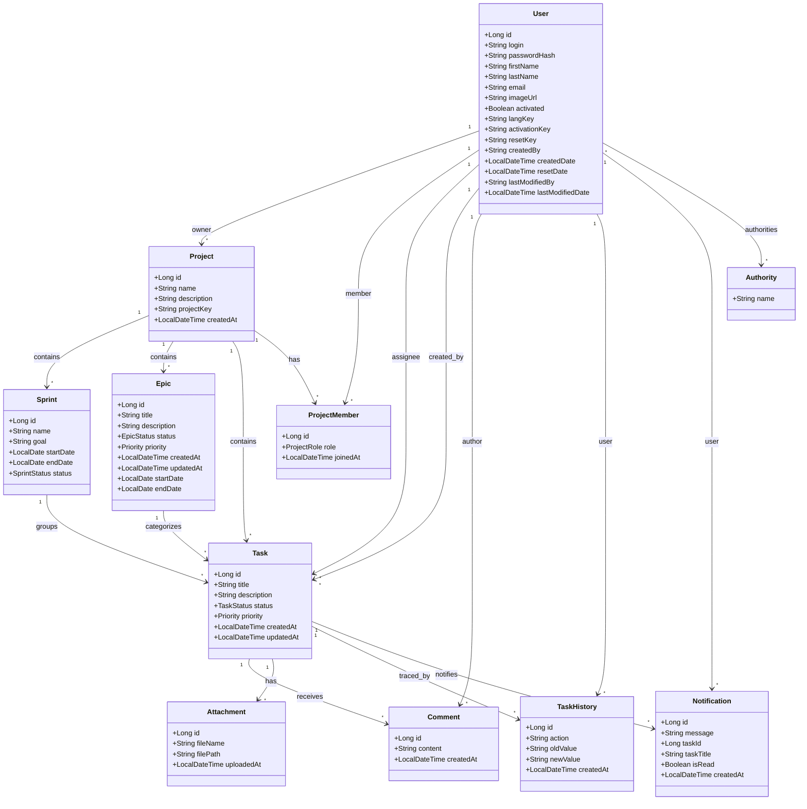
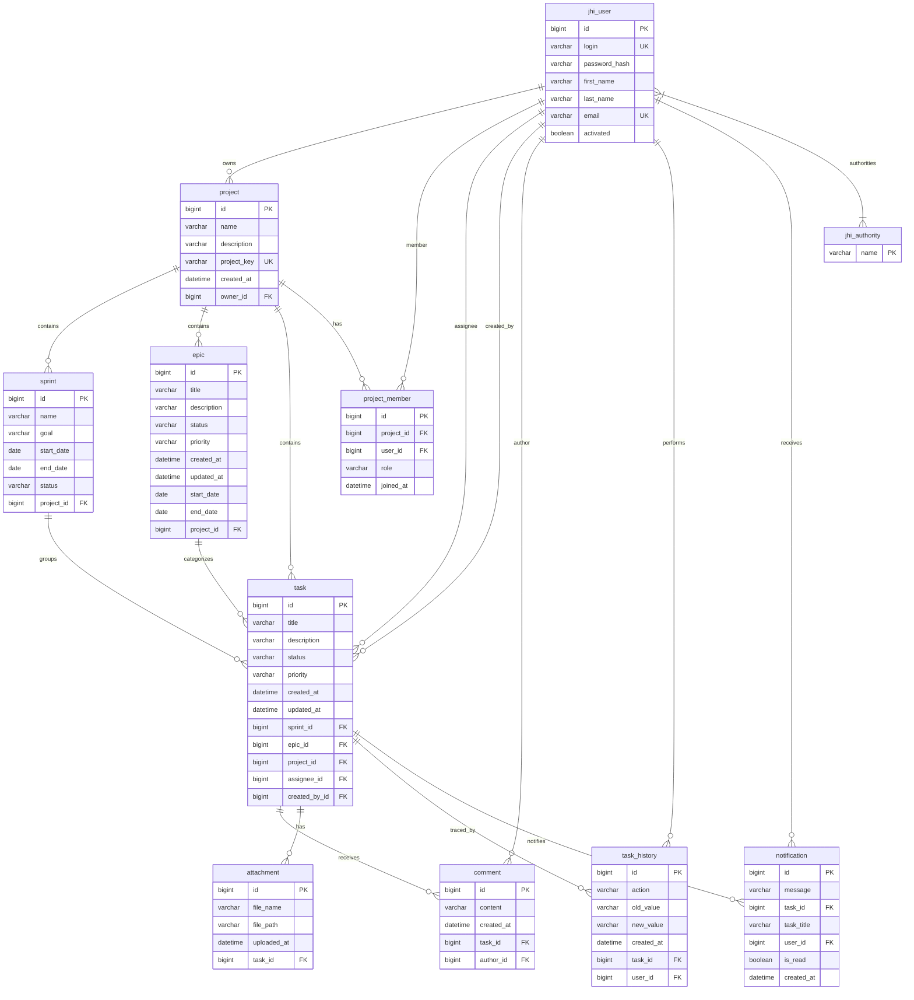

# Documentation Base de Données - Gestion de Tâches

## Technologies

- **Base de données**: PostgreSQL (prod) / H2 (dev)
- **ORM**: Hibernate/JPA
- **Migration**: Liquibase
- **Serveur Spring Boot**: 4.0.6 / Java 21

---

## Structures des Tables

### 1. `jhi_user`

| Colonne | Type | Contraintes |
|---------|------|-------------|
| `id` | `bigint` | PRIMARY KEY |
| `login` | `varchar(50)` | UNIQUE, NOT NULL |
| `password_hash` | `varchar(60)` | NOT NULL |
| `first_name` | `varchar(50)` | |
| `last_name` | `varchar(50)` | |
| `email` | `varchar(191)` | UNIQUE |
| `image_url` | `varchar(256)` | |
| `activated` | `boolean` | NOT NULL, default `false` |
| `lang_key` | `varchar(10)` | |
| `activation_key` | `varchar(20)` | |
| `reset_key` | `varchar(20)` | |
| `created_by` | `varchar(50)` | NOT NULL |
| `created_date` | `timestamp` | |
| `reset_date` | `timestamp` | |
| `last_modified_by` | `varchar(50)` | |
| `last_modified_date` | `timestamp` | |

### 2. `jhi_authority`

| Colonne | Type | Contraintes |
|---------|------|-------------|
| `name` | `varchar(50)` | PRIMARY KEY |

### 3. `jhi_user_authority` (table de jointure)

| Colonne | Type | Contraintes |
|---------|------|-------------|
| `user_id` | `bigint` | FK → `jhi_user(id)` |
| `authority_name` | `varchar(50)` | FK → `jhi_authority(name)` |
| | | PRIMARY KEY composite (`user_id`, `authority_name`) |

### 4. `project`

| Colonne | Type | Contraintes |
|---------|------|-------------|
| `id` | `bigint` | PRIMARY KEY |
| `name` | `varchar(100)` | NOT NULL |
| `description` | `varchar(500)` | |
| `project_key` | `varchar(10)` | NOT NULL, UNIQUE |
| `created_at` | `datetime` | NOT NULL |
| `owner_id` | `bigint` | FK → `jhi_user(id)` |

### 5. `project_member`

| Colonne | Type | Contraintes |
|---------|------|-------------|
| `id` | `bigint` | PRIMARY KEY |
| `project_id` | `bigint` | FK → `project(id)`, NOT NULL |
| `user_id` | `bigint` | FK → `jhi_user(id)`, NOT NULL |
| `role` | `varchar(50)` | NOT NULL (`OWNER`/`MANAGER`/`MEMBER`) |
| `joined_at` | `datetime(6)` | NOT NULL |
| | | UNIQUE(`project_id`, `user_id`) |

### 6. `sprint`

| Colonne | Type | Contraintes |
|---------|------|-------------|
| `id` | `bigint` | PRIMARY KEY |
| `name` | `varchar(100)` | NOT NULL |
| `goal` | `varchar(500)` | |
| `start_date` | `date` | |
| `end_date` | `date` | |
| `status` | `varchar(255)` | NOT NULL (`PLANNED`/`ACTIVE`/`COMPLETED`/`CANCELLED`) |
| `project_id` | `bigint` | FK → `project(id)`, NOT NULL |

### 7. `epic`

| Colonne | Type | Contraintes |
|---------|------|-------------|
| `id` | `bigint` | PRIMARY KEY |
| `title` | `varchar(200)` | NOT NULL |
| `description` | `varchar(1000)` | |
| `status` | `varchar(255)` | NOT NULL (`TODO`/`IN_PROGRESS`/`DONE`/`CANCELLED`) |
| `priority` | `varchar(255)` | NOT NULL (`LOWEST`/`LOW`/`MEDIUM`/`HIGH`/`HIGHEST`) |
| `created_at` | `datetime` | NOT NULL |
| `updated_at` | `datetime` | |
| `start_date` | `date` | |
| `end_date` | `date` | |
| `project_id` | `bigint` | FK → `project(id)`, NOT NULL |

### 8. `task`

| Colonne | Type | Contraintes |
|---------|------|-------------|
| `id` | `bigint` | PRIMARY KEY |
| `title` | `varchar(200)` | NOT NULL |
| `description` | `varchar(5000)` | |
| `status` | `varchar(255)` | NOT NULL (`NEW`/`TODO`/`IN_PROGRESS`/`IN_REVIEW`/`DONE`/`CANCELLED`) |
| `priority` | `varchar(255)` | NOT NULL (`LOWEST`/`LOW`/`MEDIUM`/`HIGH`/`HIGHEST`) |
| `created_at` | `datetime` | NOT NULL |
| `updated_at` | `datetime` | |
| `sprint_id` | `bigint` | FK → `sprint(id)` |
| `epic_id` | `bigint` | FK → `epic(id)` |
| `project_id` | `bigint` | FK → `project(id)`, NOT NULL |
| `assignee_id` | `bigint` | FK → `jhi_user(id)` |
| `created_by_id` | `bigint` | FK → `jhi_user(id)` |

### 9. `comment`

| Colonne | Type | Contraintes |
|---------|------|-------------|
| `id` | `bigint` | PRIMARY KEY |
| `content` | `varchar(2000)` | NOT NULL |
| `created_at` | `datetime` | NOT NULL |
| `task_id` | `bigint` | FK → `task(id)`, NOT NULL |
| `author_id` | `bigint` | FK → `jhi_user(id)` |

### 10. `attachment`

| Colonne | Type | Contraintes |
|---------|------|-------------|
| `id` | `bigint` | PRIMARY KEY |
| `file_name` | `varchar(255)` | NOT NULL |
| `file_path` | `varchar(1000)` | NOT NULL |
| `uploaded_at` | `datetime` | NOT NULL |
| `task_id` | `bigint` | FK → `task(id)`, NOT NULL |

### 11. `task_history`

| Colonne | Type | Contraintes |
|---------|------|-------------|
| `id` | `bigint` | PRIMARY KEY |
| `action` | `varchar(100)` | NOT NULL |
| `old_value` | `varchar(500)` | |
| `new_value` | `varchar(500)` | |
| `created_at` | `datetime` | NOT NULL |
| `task_id` | `bigint` | FK → `task(id)`, NOT NULL |
| `user_id` | `bigint` | FK → `jhi_user(id)`, NOT NULL |

### 12. `notification`

| Colonne | Type | Contraintes |
|---------|------|-------------|
| `id` | `bigint` | PRIMARY KEY, auto-increment |
| `message` | `varchar(500)` | NOT NULL |
| `task_id` | `bigint` | FK → `task(id)` |
| `task_title` | `varchar(200)` | |
| `user_id` | `bigint` | FK → `jhi_user(id)`, NOT NULL |
| `is_read` | `boolean` | NOT NULL, default `false` |
| `created_at` | `datetime(6)` | NOT NULL |

---

## Énumérations

| Enum | Valeurs |
|------|---------|
| `SprintStatus` | `PLANNED`, `ACTIVE`, `COMPLETED`, `CANCELLED` |
| `EpicStatus` | `TODO`, `IN_PROGRESS`, `DONE`, `CANCELLED` |
| `TaskStatus` | `NEW`, `TODO`, `IN_PROGRESS`, `IN_REVIEW`, `DONE`, `CANCELLED` |
| `Priority` | `LOWEST`, `LOW`, `MEDIUM`, `HIGH`, `HIGHEST` |
| `ProjectRole` | `OWNER`, `MANAGER`, `MEMBER` |

---

## Diagramme de Classes (Mermaid)



---

## Diagramme Entité-Relation (Mermaid)



---

## Schéma Relationnel Résumé

```
jhi_user (id, login, password_hash, first_name, last_name, email, image_url, activated, lang_key, activation_key, reset_key, created_by, created_date, reset_date, last_modified_by, last_modified_date)

jhi_authority (name)

jhi_user_authority (user_id, authority_name)

project (id, name, description, project_key, created_at, owner_id)

project_member (id, project_id, user_id, role, joined_at)

sprint (id, name, goal, start_date, end_date, status, project_id)

epic (id, title, description, status, priority, created_at, updated_at, start_date, end_date, project_id)

task (id, title, description, status, priority, created_at, updated_at, sprint_id, epic_id, project_id, assignee_id, created_by_id)

comment (id, content, created_at, task_id, author_id)

attachment (id, file_name, file_path, uploaded_at, task_id)

task_history (id, action, old_value, new_value, created_at, task_id, user_id)

notification (id, message, task_id, task_title, user_id, is_read, created_at)
```

---

## Matrice des Dépendances

| Table | Dépend de |
|-------|-----------|
| `jhi_user` | — |
| `jhi_authority` | — |
| `jhi_user_authority` | `jhi_user`, `jhi_authority` |
| `project` | `jhi_user` (owner) |
| `project_member` | `project`, `jhi_user` |
| `sprint` | `project` |
| `epic` | `project` |
| `task` | `project`, `sprint`, `epic`, `jhi_user` (assignee, created_by) |
| `comment` | `task`, `jhi_user` (author) |
| `attachment` | `task` |
| `task_history` | `task`, `jhi_user` |
| `notification` | `task`, `jhi_user` |
