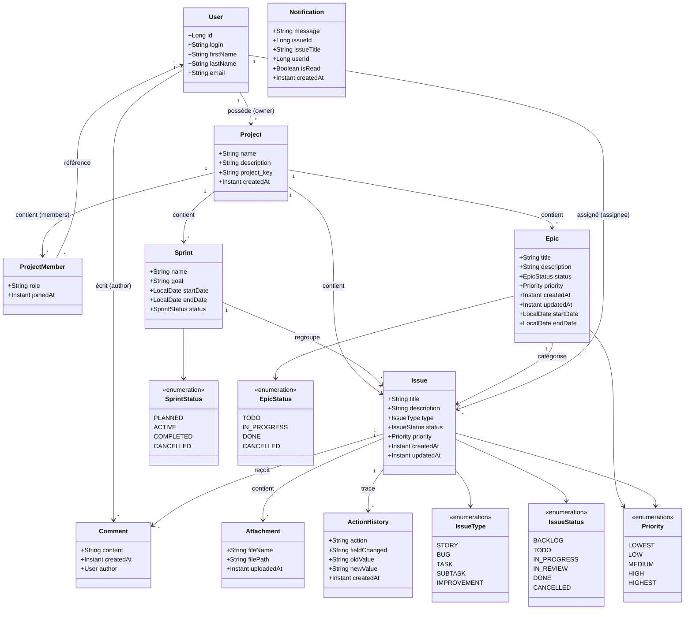
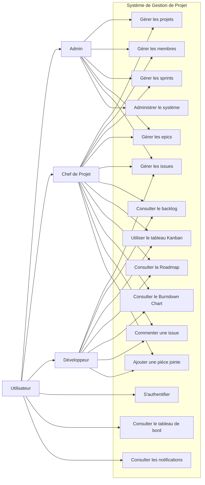
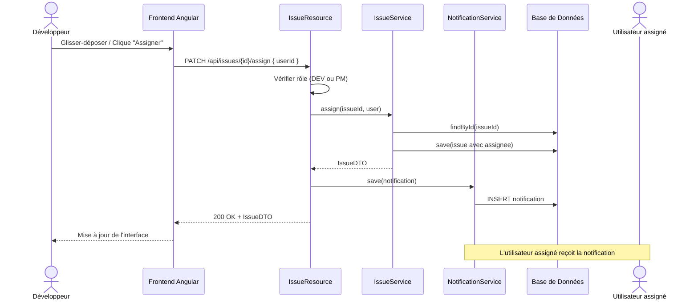
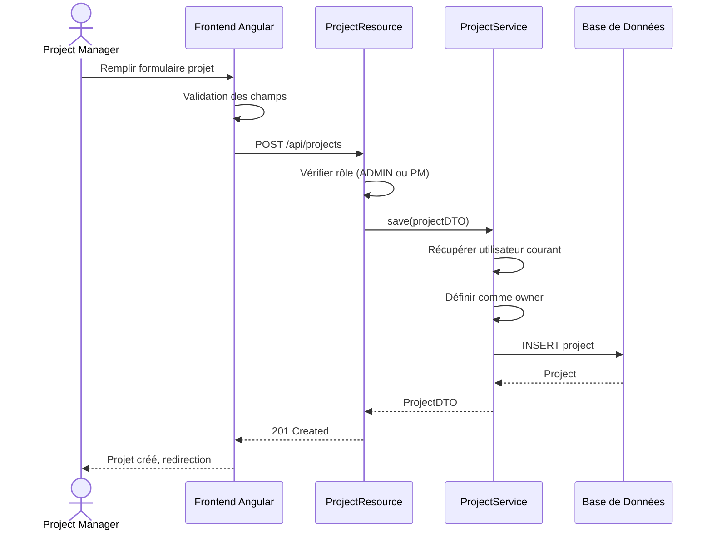
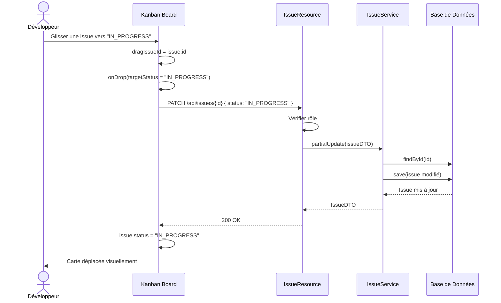
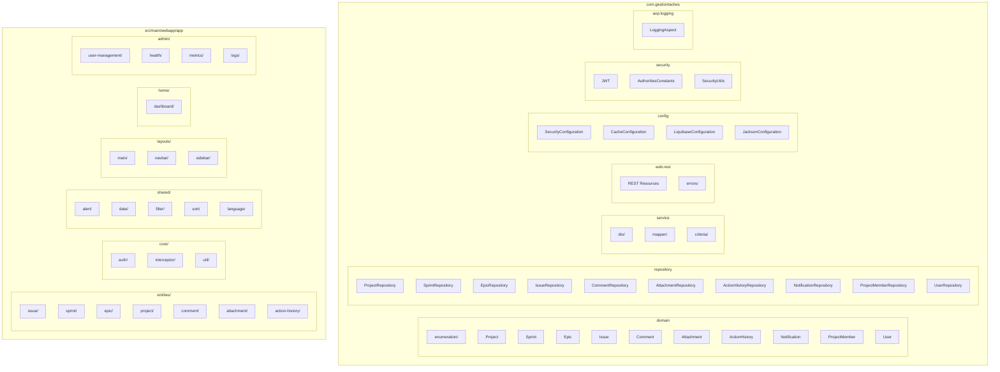
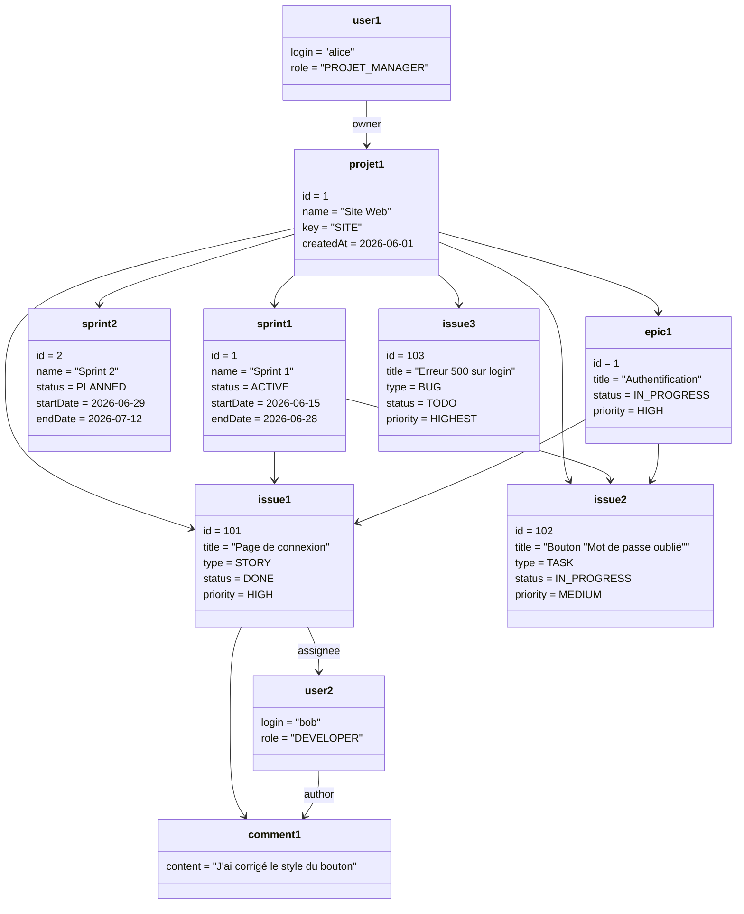
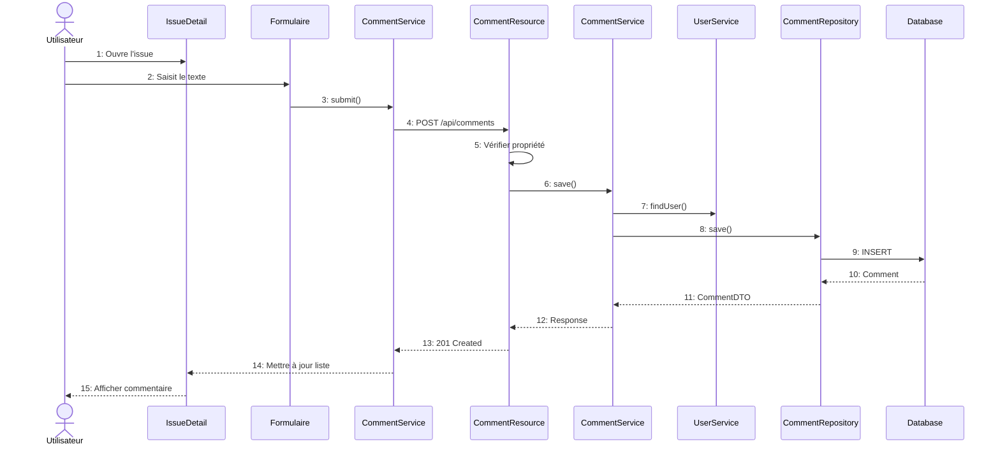

# Fiche Technique — Diagrammes UML du Projet

## 1. Diagramme de Classes (Class Diagram)

Ce diagramme modélise la structure statique du système : les entités métier (User, Project, Issue, etc.), leurs attributs, leurs types (enumérations) et les associations qui les relient (propriétaire, membres, sprint, epic, commentaires, etc.).

---

## 2. Diagramme de Cas d'Utilisation (Use Case Diagram)

### Description des Cas d'Utilisation

| Code | Nom | Acteurs | Description |
|------|-----|---------|-------------|
| UC1 | Gérer les projets | Admin, PM | Créer, modifier, supprimer un projet |
| UC2 | Gérer les membres | Admin, PM | Ajouter/retirer un membre, changer son rôle |
| UC3 | Gérer les sprints | Admin, PM | Créer, démarrer, compléter un sprint |
| UC4 | Gérer les epics | Admin, PM | Créer, modifier, supprimer un epic |
| UC5 | Gérer les issues | Admin, PM, DEV | CRUD + assignation + changement de statut |
| UC6 | Tableau Kanban | PM, DEV | Visualiser et glisser-déposer les issues |
| UC7 | Roadmap Epic | PM, DEV | Vue d'ensemble des epics avec progression |
| UC8 | Burndown Chart | PM, DEV | Graphique d'avancement du sprint |
| UC9 | Commenter une issue | PM, DEV, U | Ajouter/modifier/supprimer un commentaire |
| UC10 | Joindre un fichier | PM, DEV | Uploader un fichier sur une issue |
| UC11 | Dashboard | U | Voir les KPI, graphiques et activités récentes |
| UC12 | Notifications | U | Recevoir et consulter les notifications |
| UC13 | Administration | Admin | Gérer les utilisateurs, rôles, configuration |
| UC14 | Authentification | Tous | Se connecter / se déconnecter (JWT) |
| UC15 | Inscription | U | Créer un compte |

---

## 3. Diagramme de Séquence (Sequence Diagram)

Ce diagramme montre les interactions temporelles entre les acteurs et les composants du système pour des scénarios clés : assignation d'une issue, création d'un projet et changement de statut via le tableau Kanban.

### 3.1 Assignation d'une issue

### 3.2 Création d'un projet

### 3.3 Changement de statut d'une issue (Drag & Drop Kanban)

---

## 8. Diagramme de Paquetages (Package Diagram)

Ce diagramme illustre la structure des paquetages du projet : l'organisation du backend (domain, repository, service, web.rest, config, security, aop) et du frontend (entities, core, shared, layouts, home, admin), avec leurs dépendances.

### Dépendances entre Paquetages

| Paquetage | Dépend de |
|-----------|-----------|
| `web.rest` | `service`, `security`, `repository` |
| `service` | `repository`, `domain`, `service.dto`, `service.mapper` |
| `service.dto` | `domain` |
| `service.mapper` | `domain`, `service.dto` |
| `repository` | `domain` |
| `config` | `security`, `domain` |
| `entities/` (frontend) | `core/util`, `shared/` |
| `home/dashboard` | `core/config`, `entities/` |

---

## 9. Diagramme d'Objets (Object Diagram)

Ce diagramme présente un snapshot concret d'instances du système à un moment donné : un projet "Site Web" avec ses sprints, epics, issues, commentaires et utilisateurs, illustrant les relations entre objets réels.

### Exemple d'instances en cours d'exécution

---

## 10. Diagramme de Communication (Communication Diagram)

Ce diagramme montre les interactions entre les objets et acteurs lors de la création d'un commentaire sur une issue, en mettant l'accent sur l'ordre des messages échangés (de l'ouverture de l'issue jusqu'à l'affichage du commentaire).

### Création d'un commentaire sur une issue

---
