# Fiche Technique — Diagrammes UML du Projet

## 1. Diagramme de Classes (Class Diagram)

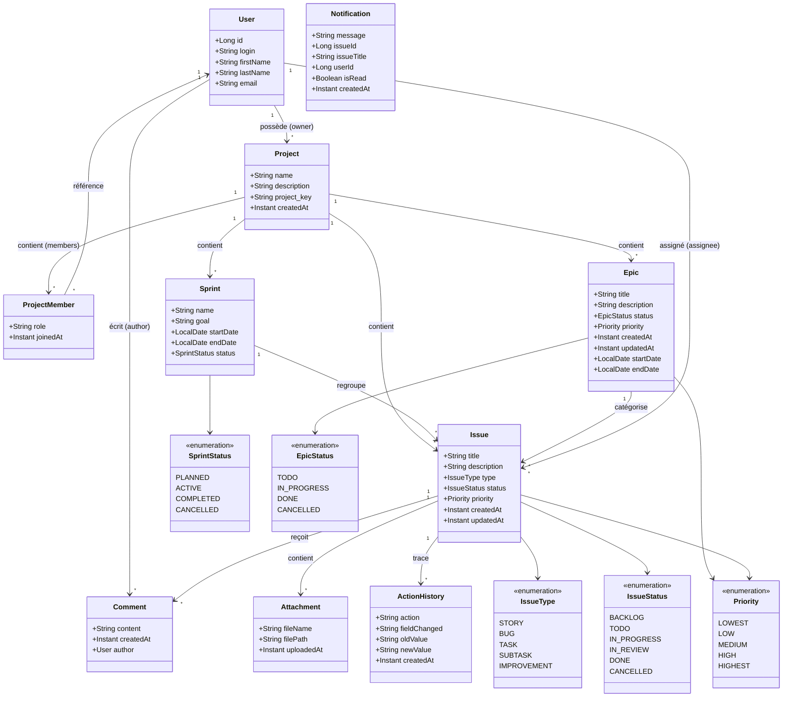

---

## 2. Diagramme de Cas d'Utilisation (Use Case Diagram)

```mermaid
flowchart TD
    subgraph Acteurs
        A[Admin]
        PM[Project Manager]
        DEV[Developer]
        U[User]
    end

    subgraph Système[Système de Gestion de Tâches]
        UC1[Gérer les projets]
        UC2[Gérer les membres]
        UC3[Gérer les sprints]
        UC4[Gérer les epics]
        UC5[Gérer les issues]
        UC6[Tableau Kanban]
        UC7[Roadmap Epic]
        UC8[Burndown Chart]
        UC9[Commenter une issue]
        UC10[Joindre un fichier]
        UC11[Consulter le dashboard]
        UC12[Gérer les notifications]
        UC13[Administrer le système]
        UC14[S'authentifier]
        UC15[S'inscrire]
    end

    A --> UC1
    A --> UC2
    A --> UC3
    A --> UC4
    A --> UC5
    A --> UC13

    PM --> UC1
    PM --> UC2
    PM --> UC3
    PM --> UC4
    PM --> UC5
    PM --> UC6
    PM --> UC7
    PM --> UC8

    DEV --> UC5
    DEV --> UC6
    DEV --> UC7
    DEV --> UC8
    DEV --> UC9
    DEV --> UC10

    U --> UC9
    U --> UC11
    U --> UC12
    U --> UC14
    U --> UC15
```

### Description des Cas d'Utilisation

| Code | Nom | Acteurs | Description |
|------|-----|---------|-------------|
| UC1 | Gérer les projets | Admin, PM | Créer, modifier, supprimer un projet |
| UC2 | Gérer les membres | Admin, PM | Ajouter/retirer un membre, changer son rôle |
| UC3 | Gérer les sprints | Admin, PM | Créer, démarrer, compléter un sprint |
| UC4 | Gérer les epics | Admin, PM | Créer, modifier, supprimer un epic |
| UC5 | Gérer les issues | Admin, PM, DEV | CRUD + assignation + changement de statut |
| UC6 | Tableau Kanban | PM, DEV | Visualiser et glisser-déposer les issues |
| UC7 | Roadmap Epic | PM, DEV | Vue d'ensemble des epics avec progression |
| UC8 | Burndown Chart | PM, DEV | Graphique d'avancement du sprint |
| UC9 | Commenter une issue | PM, DEV, U | Ajouter/modifier/supprimer un commentaire |
| UC10 | Joindre un fichier | PM, DEV | Uploader un fichier sur une issue |
| UC11 | Dashboard | U | Voir les KPI, graphiques et activités récentes |
| UC12 | Notifications | U | Recevoir et consulter les notifications |
| UC13 | Administration | Admin | Gérer les utilisateurs, rôles, configuration |
| UC14 | Authentification | Tous | Se connecter / se déconnecter (JWT) |
| UC15 | Inscription | U | Créer un compte |

---

## 3. Diagramme de Séquence (Sequence Diagram)

### 3.1 Assignation d'une issue

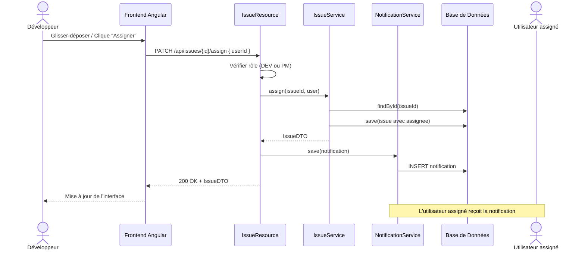

### 3.2 Création d'un projet

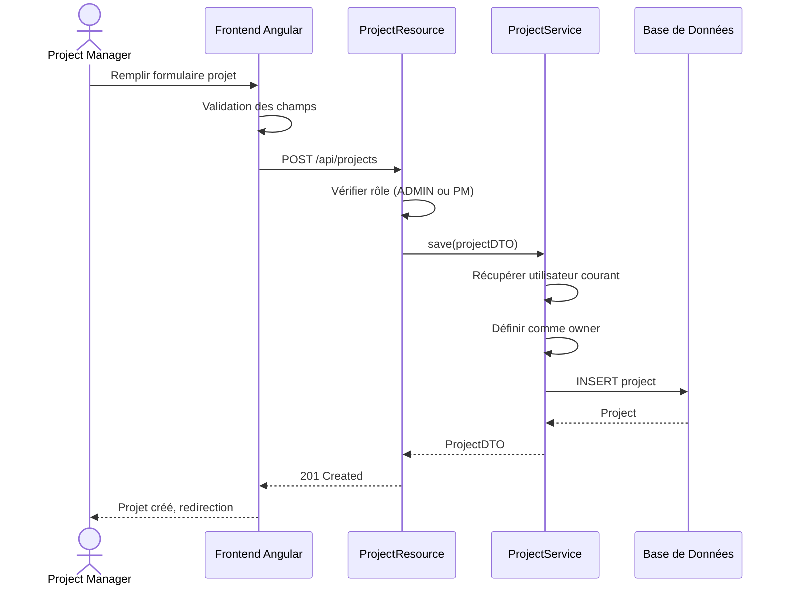

### 3.3 Changement de statut d'une issue (Drag & Drop Kanban)

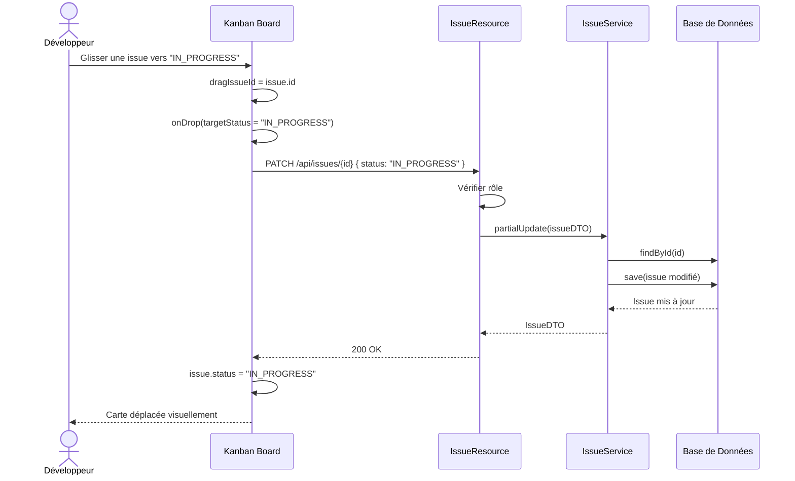

---

## 4. Diagramme d'Activité (Activity Diagram)

### Cycle de vie d'une Issue

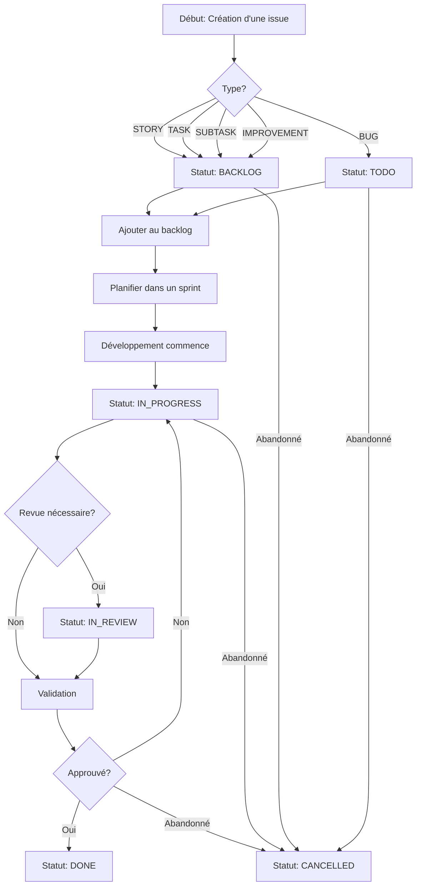

### Processus de Sprint

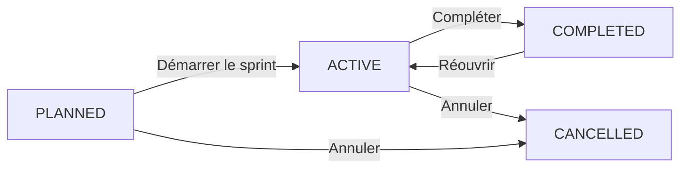

---

## 5. Diagramme d'États (State Machine Diagram)

### Issue States

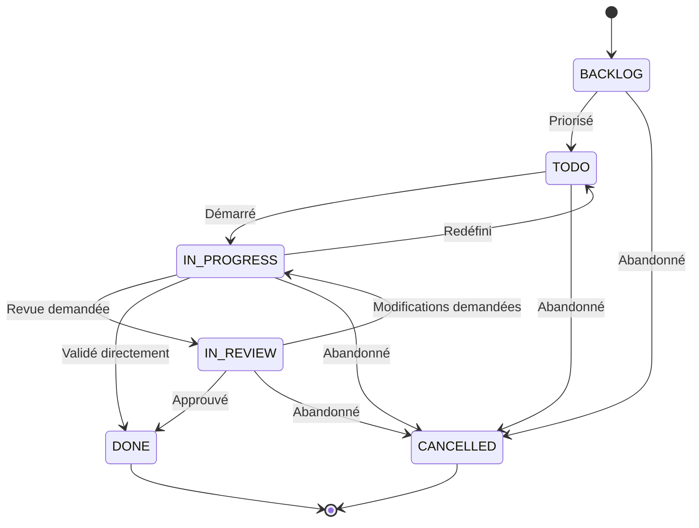

### Sprint States

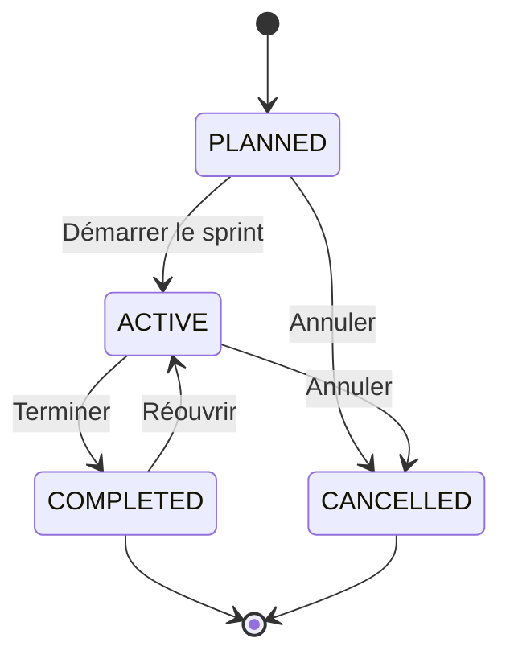

### Epic States

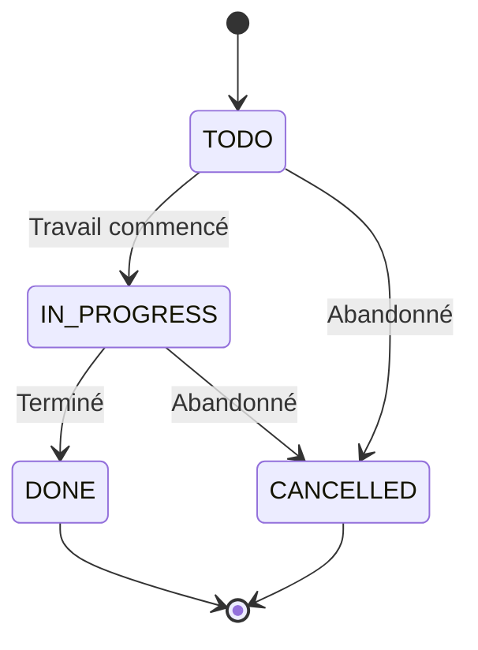

---

## 6. Diagramme de Déploiement (Deployment Diagram)

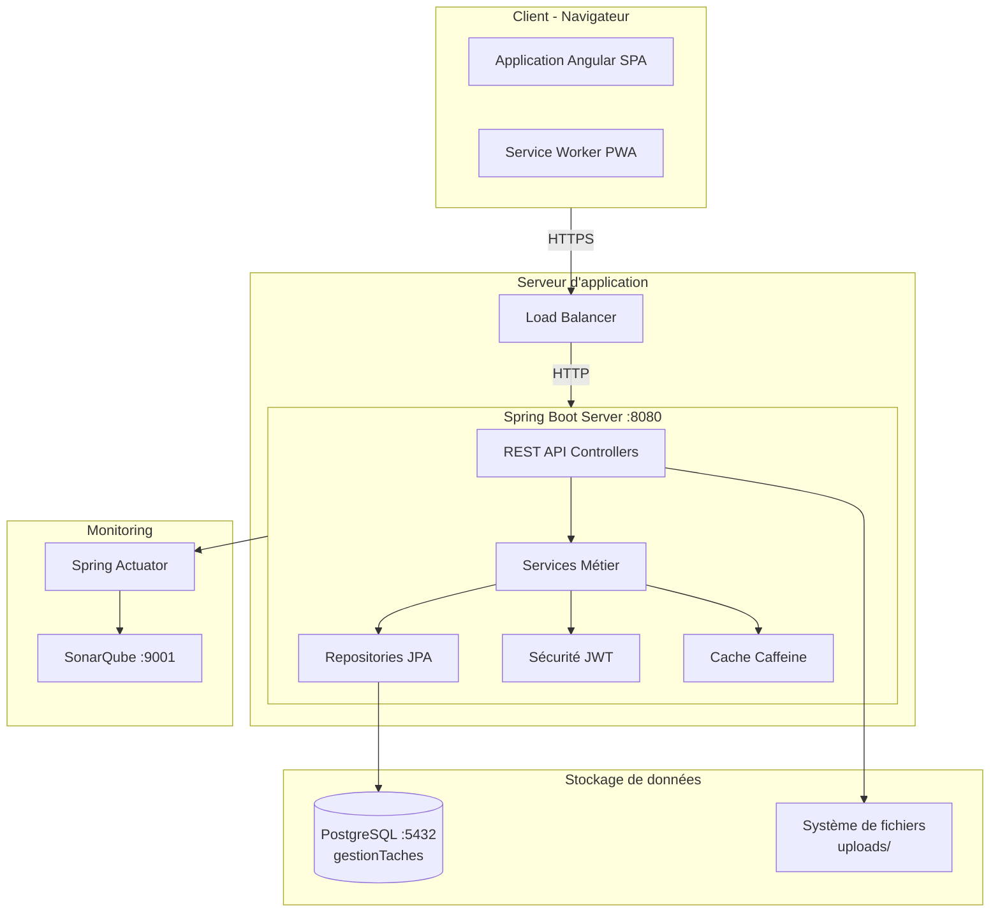

---

## 7. Diagramme de Composants (Component Diagram)

```mermaid
flowchart TD
    subgraph Frontend[Frontend Angular]
        App[Application Root]
        Router[Router]
        subgraph Pages[Pages & Composants]
            Dashboard
            Kanban
            SprintBoard
            EpicRoadmap
            IssueDetail
            Admin
        end
        subgraph Services[Services]
            IssueService
            SprintService
            ProjectService
            EpicService
            NotificationService
            AuthService
        end
        subgraph Shared[Modules Partagés]
            AlertComponent
            TranslateModule
            Pagination
            FilterComponent
        end
    end

    subgraph Backend[Backend Spring Boot]
        subgraph Controllers[REST Controllers]
            ProjectResource
            SprintResource
            EpicResource
            IssueResource
            CommentResource
            AttachmentResource
            NotificationResource
            AccountResource
        end
        subgraph ServicesLayer[Services Layer]
            ProjectService
            SprintService
            EpicService
            IssueService
            CommentService
            AttachmentService
            NotificationService
            MailService
        end
        subgraph DataAccess[Data Access]
            Repositories
            Mappers MapStruct
            DTOs
        end
        subgraph Security[Security]
            JWT
            BCrypt
            @PreAuthorize
        end
    end

    subgraph Database[Base de Données]
        Tables[Tables JPA]
        Liquibase[Migrations Liquibase]
    end

    App --> Router
    Router --> Pages
    Pages --> Services
    Pages --> Shared
    Services --> Controllers
    Controllers --> ServicesLayer
    ServicesLayer --> DataAccess
    DataAccess --> Tables
    Security --> Controllers
    Tables --> Liquibase
```

---

## 8. Diagramme de Paquetages (Package Diagram)

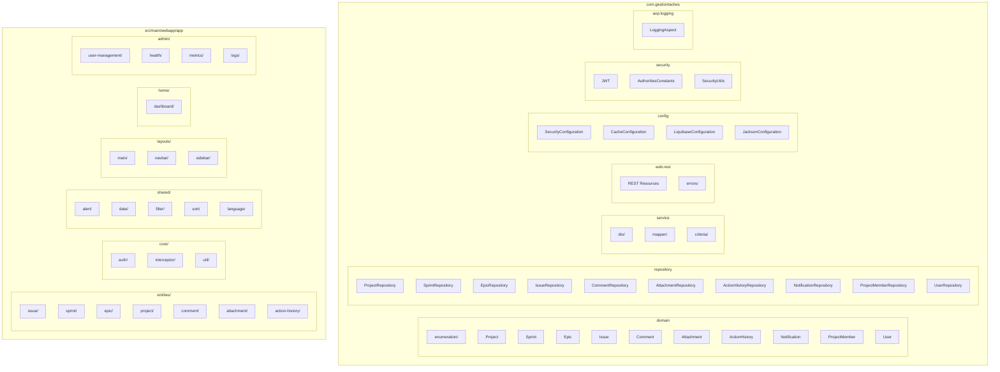

### Dépendances entre Paquetages

| Paquetage | Dépend de |
|-----------|-----------|
| `web.rest` | `service`, `security`, `repository` |
| `service` | `repository`, `domain`, `service.dto`, `service.mapper` |
| `service.dto` | `domain` |
| `service.mapper` | `domain`, `service.dto` |
| `repository` | `domain` |
| `config` | `security`, `domain` |
| `entities/` (frontend) | `core/util`, `shared/` |
| `home/dashboard` | `core/config`, `entities/` |

---

## 9. Diagramme d'Objets (Object Diagram)

### Exemple d'instances en cours d'exécution

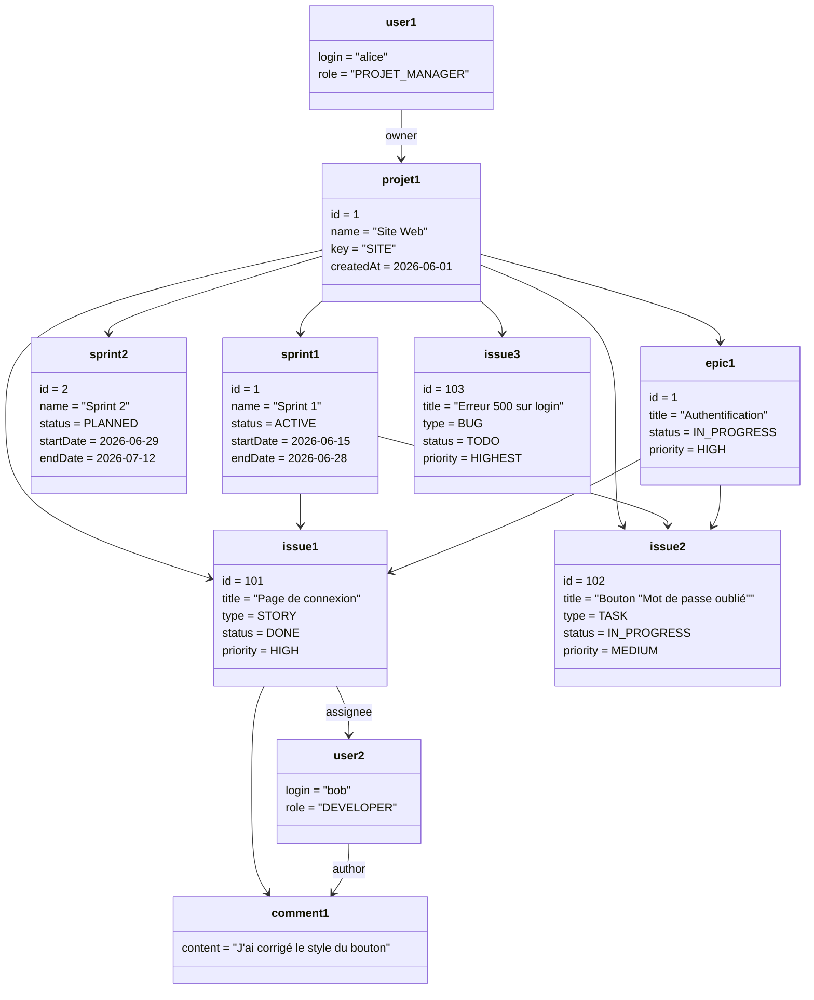

---

## 10. Diagramme de Communication (Communication Diagram)

### Création d'un commentaire sur une issue

```mermaid
flowchart TD
    1[Utilisateur] -->|2: Saisit le texte| F[Formulaire]
    1 -->|1: Ouvre l'issue| D[IssueDetail]
    F -->|3: submit()| CS[CommentService.create]
    CS -->|4: POST /api/comments| API[CommentResource]
    API -->|5: checkCommentOwnership| API
    API -->|6: save| SVC[CommentService]
    SVC -->|7: findUser| US[UserService]
    SVC -->|8: save| REP[CommentRepository]
    REP -->|9: INSERT| DB[(Database)]
    DB -->|10: Comment| REP
    REP -->|11: CommentDTO| SVC
    SVC -->|12: Response| API
    API -->|13: 201 Created| CS
    CS -->|14: Mise à jour liste| D
    D -->|15: Affiche nouveau commentaire| 1
```

**Liens :**
- `1` → `D` : navigation
- `F` → `CS` : appel de méthode
- `CS` → `API` : requête HTTP
- `API` → `SVC` : appel service
- `SVC` → `REP` : persistence JPA
- `REP` → `DB` : requête SQL

---

## 11. Diagramme de Timing (Timing Diagram)

### Cycle de vie d'un Sprint (20 jours)

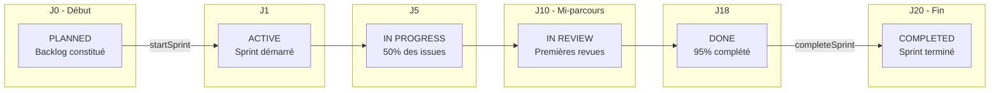

### Métriques temporelles d'une Issue

| Jour | Événement | Statut | Commentaire |
|------|-----------|--------|-------------|
| J0 | Création | BACKLOG | Issue créée dans le backlog |
| J3 | Priorisation | TODO | Ajoutée au sprint courant |
| J5 | Développement | IN_PROGRESS | Travail commencé |
| J9 | Code review | IN_REVIEW | Pull request soumise |
| J10 | Validation | DONE | Merge effectué |
| J20 | Fin de sprint | DONE | Sprint complété |

---

## 12. Diagramme de Structure Composite (Composite Structure Diagram)

### Structure interne d'une Issue

```mermaid
flowchart TD
    subgraph Issue[Issue #id]
        direction LR
        subgraph Props[Propriétés]
            title
            description
            type
            status
            priority
            createdAt
            updatedAt
        end
        subgraph Parts[Parties]
            CommentList[comments: Comment[]]
            AttachmentList[attachments: Attachment[]]
            HistoryList[history: ActionHistory[]]
        end
        subgraph Refs[Références Externes]
            Proj[project: Project]
            Spr[sprint: Sprint]
            Ep[epic: Epic]
            Assign[assignee: User]
        end
    end

    Props --- Parts
    Parts --- Refs
```

### Ports et Interfaces

| Port | Interface | Connecteur |
|------|-----------|------------|
| `IssueResource` | `REST: /api/issues` | HTTP |
| `IssueService` | `IssueDTO ↔ Issue` | MapStruct |
| `IssueRepository` | `JPA Repository` | Hibernate |
| `NotificationService` | `assign()` | Événement |

---

## 13. Diagramme de Profils (Profile Diagram)

### Stéréotypes et Tags appliqués au projet

```mermaid
classDiagram
    class <<stereotype>> Entity {
        +tableName: String
        +changelogDate: String
        +service: String = "serviceClass"
        +dto: String = "mapstruct"
        +pagination: String
    }

    class <<stereotype>> Service {
        +logging: boolean = true
        +transactional: boolean = true
    }

    class <<stereotype>> RestController {
        +basePath: String
        +entityName: String
    }

    class <<stereotype>> DTO {
        +mapstruct: boolean = true
    }

    class <<stereotype>> Enum

    Entity <|-- Project
    Entity <|-- Sprint
    Entity <|-- Epic
    Entity <|-- Issue
    Entity <|-- Comment
    Entity <|-- Attachment
    Entity <|-- ActionHistory

    Service <|-- ProjectService
    Service <|-- SprintService
    Service <|-- IssueService

    RestController <|-- ProjectResource
    RestController <|-- SprintResource
    RestController <|-- IssueResource

    DTO <|-- ProjectDTO
    DTO <|-- IssueDTO

    Enum <|-- IssueStatus
    Enum <|-- SprintStatus
    Enum <|-- Priority
    Enum <|-- IssueType
    Enum <|-- EpicStatus
```

### Contraintes UML

| Stéréotype | Cible | Tags |
|------------|-------|------|
| `Entity` | Classes du package `domain/` | `tableName`, `changelogDate`, `service`, `dto`, `pagination` |
| `Service` | Classes du package `service/` | `logging`, `transactional` |
| `RestController` | Classes du package `web/rest/` | `basePath`, `entityName` |
| `DTO` | Classes du package `service/dto/` | `mapstruct` |
| `Enum` | Classes du package `domain/enumeration/` | — |

---

## 14. Diagramme de Vue d'Ensemble des Interactions (Interaction Overview Diagram)

### Création d'une issue avec commentaire et pièce jointe

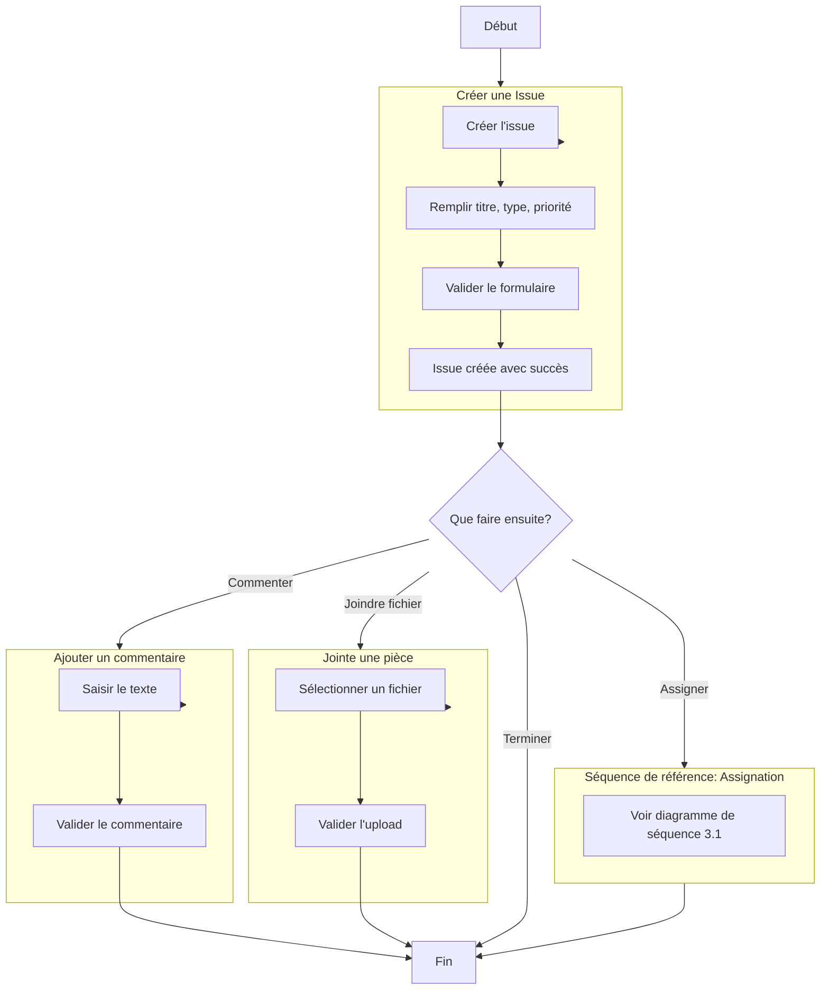

Ce diagramme combine plusieurs diagrammes de séquence et d'activité pour montrer un flux de travail complet.

---

## Tableau récapitulatif des 14 diagrammes UML

| # | Diagramme UML | Type | Outil utilisé | Fichier/Package couvert |
|---|---|---|---|---|
| 1 | Diagramme de classes | Structure | Mermaid `classDiagram` | `domain/`, `domain/enumeration/` |
| 2 | Diagramme de cas d'utilisation | Comportement | Mermaid `flowchart` | Fonctionnalités du système |
| 3 | Diagramme de séquence | Comportement | Mermaid `sequenceDiagram` | Assignation, création projet, Kanban |
| 4 | Diagramme d'activité | Comportement | Mermaid `flowchart` | Cycle de vie issue, processus sprint |
| 5 | Diagramme d'états | Comportement | Mermaid `stateDiagram-v2` | Issue, Sprint, Epic |
| 6 | Diagramme de déploiement | Structure | Mermaid `flowchart` | Architecture physique |
| 7 | Diagramme de composants | Structure | Mermaid `flowchart` | Modules Angular + Spring |
| 8 | Diagramme de paquetages | Structure | Mermaid `flowchart` | Structure des packages |
| 9 | Diagramme d'objets | Structure | Mermaid `classDiagram` | Instances d'exemple |
| 10 | Diagramme de communication | Comportement | Mermaid `flowchart` | Création d'un commentaire |
| 11 | Diagramme de timing | Comportement | Mermaid `flowchart` | Cycle de sprint + métriques |
| 12 | Diagramme de structure composite | Structure | Mermaid `flowchart` | Structure interne d'une Issue |
| 13 | Diagramme de profils | Structure | Mermaid `classDiagram` | Stéréotypes JHipster |
| 14 | Diagramme de vue d'ensemble des interactions | Comportement | Mermaid `flowchart` | Flux complet création issue |

---

## Rôle de Chaque Table

### Project
Table racine du système. Représente un projet (ex. une application, un produit). Contient les sprints, epics et issues. Un `key` unique sert d'identifiant court (ex. `PROJ`). Chaque projet a un propriétaire (`owner_id` → `jhi_user`) et une équipe via la table `project_member`.

### ProjectMember
Table de jointure enrichie entre Project et User. Remplace l'ancienne table de jointure `project_members`. Chaque entrée possède un identifiant unique, un rôle (`MEMBER`, `LEAD`, etc.) et une date d'ajout. Permet une gestion d'équipe plus fine qu'un simple ManyToMany.

### Sprint
Itération de développement dans un projet. Regroupe un ensemble d'issues à réaliser sur une période donnée. Peut être PLANIFIÉ, ACTIF, TERMINÉ ou ANNULÉ.

### Epic
Regroupement logique d'issues correspondant à une fonctionnalité transverse de grande envergure. Permet de suivre un objectif métier à travers plusieurs sprints.

### Issue
Unité de travail atomique. Peut être un Story, Bug, Task, Subtask ou Improvement. Suit un cycle de vie complet (BACKLOG → DONE). Liée à un sprint et/ou un epic.

### Comment
Commentaire texte attaché à une issue. Possède un auteur (`author_id` → `jhi_user`). Permet la discussion et le suivi collaboratif.

### Attachment
Fichier joint à une issue (capture d'écran, document, etc.). Stocke le chemin du fichier et son nom original.

### ActionHistory
Trace d'audit détaillant chaque modification d'une issue. Enregistre l'action, le champ modifié, l'ancienne et la nouvelle valeur.

---

## Dépendances entre Tables

| Table | Dépend de | Est utilisé par |
|-------|-----------|-----------------|
| User | — | Project (owner), ProjectMember, Issue (assignee), Comment (author) |
| Project | User (owner) | Sprint, Epic, Issue, ProjectMember |
| ProjectMember | Project, User | — |
| Sprint | Project | Issue |
| Epic | Project | Issue |
| Issue | Project, Sprint, Epic | Comment, Attachment, ActionHistory |
| Comment | Issue, User (author) | — |
| Attachment | Issue | — |
| ActionHistory | Issue | — |
