# Fiche Technique — Diagrammes UML du Projet

## 1. Diagramme de Classes (Class Diagram)

Ce diagramme modélise la structure statique du système : les entités métier (User, Project, Task, etc.), leurs attributs, leurs types (enumérations) et les associations qui les relient (propriétaire, membres, sprint, epic, commentaires, etc.).

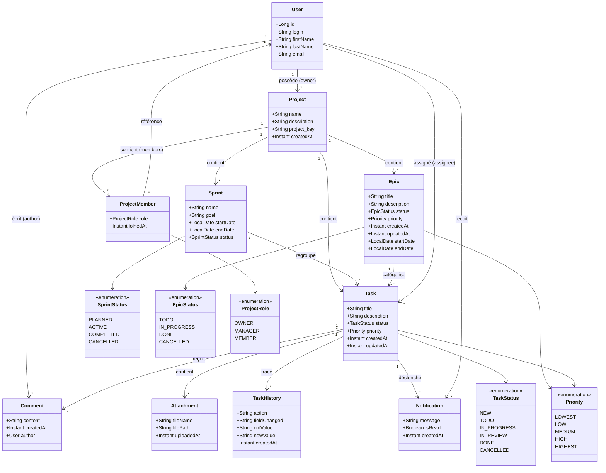

---

## 2. Diagramme de Cas d'Utilisation (Use Case Diagram)

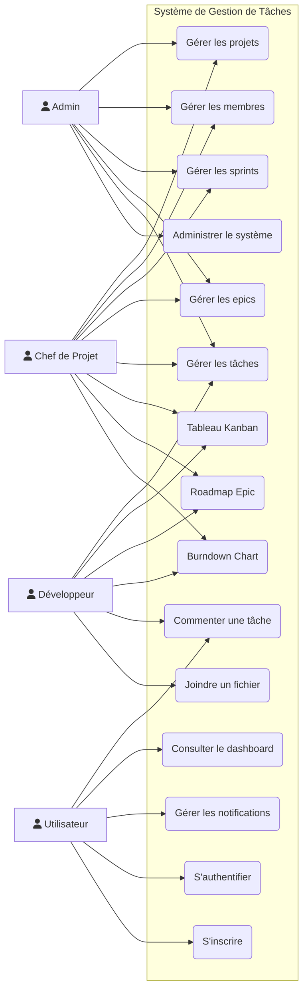

### Description des Cas d'Utilisation

| Code | Nom | Acteurs | Description |
|------|-----|---------|-------------|
| UC1 | Gérer les projets | Admin, PM | Créer, modifier, supprimer un projet |
| UC2 | Gérer les membres | Admin, PM | Ajouter/retirer un membre, changer son rôle |
| UC3 | Gérer les sprints | Admin, PM | Créer, démarrer, compléter un sprint |
| UC4 | Gérer les epics | Admin, PM | Créer, modifier, supprimer un epic |
| UC5 | Gérer les tâches | Admin, PM, DEV | CRUD + assignation + changement de statut |
| UC6 | Tableau Kanban | PM, DEV | Visualiser et glisser-déposer les tâches |
| UC7 | Roadmap Epic | PM, DEV | Vue d'ensemble des epics avec progression |
| UC8 | Burndown Chart | PM, DEV | Graphique d'avancement du sprint |
| UC9 | Commenter une tâche | PM, DEV, U | Ajouter/modifier/supprimer un commentaire |
| UC10 | Joindre un fichier | PM, DEV | Uploader un fichier sur une tâche |
| UC11 | Dashboard | U | Voir les KPI, graphiques et activités récentes |
| UC12 | Notifications | U | Recevoir et consulter les notifications |
| UC13 | Administration | Admin | Gérer les utilisateurs, rôles, configuration |
| UC14 | Authentification | Tous | Se connecter / se déconnecter (JWT) |
| UC15 | Inscription | U | Créer un compte |

---

## 3. Diagramme de Séquence (Sequence Diagram)

Ce diagramme montre les interactions temporelles entre les acteurs et les composants du système pour des scénarios clés : assignation d'une tâche, création d'un projet et changement de statut via le tableau Kanban.

### 3.1 Assignation d'une tâche

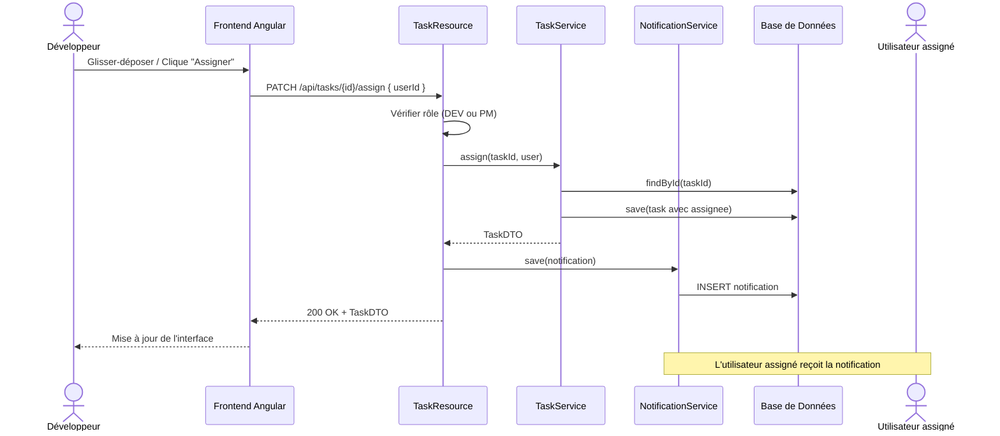

### 3.2 Création d'un projet

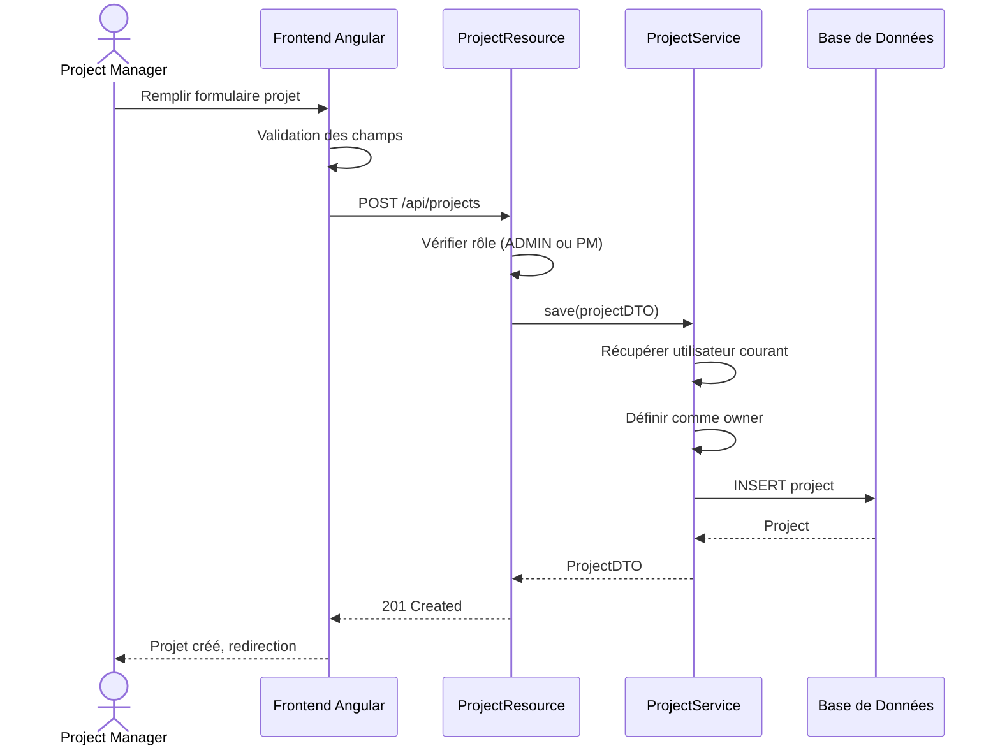

### 3.3 Changement de statut d'une tâche (Drag & Drop Kanban)

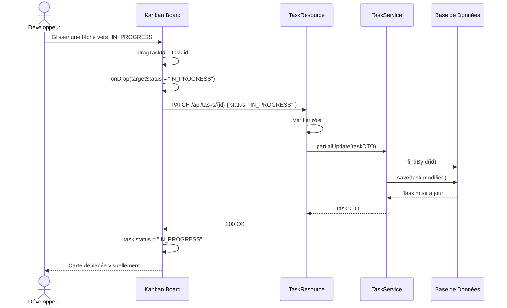

---

## 4. Diagramme d'Activité (Activity Diagram)

Ce diagramme modélise les flux de travail du système : le cycle de vie complet d'une tâche (de la création à la validation ou l'annulation) et le processus de gestion d'un sprint (démarrage, complétion, annulation).

### Cycle de vie d'une Tâche

```mermaid
flowchart TD
    A[Début: Création d'une tâche] --> B[Statut: NEW]

    B --> C[Planifier dans un sprint]

    C --> D[Développement commence]
    D --> E[Statut: IN_PROGRESS]

    E --> F{Revue nécessaire?}
    F -->|Oui| G[Statut: IN_REVIEW]
    F -->|Non| H[Validation]

    G --> H
    H --> I{Approuvé?}
    I -->|Oui| J[Statut: DONE]
    I -->|Non| E
    I -->|Abandonné| K[Statut: CANCELLED]

    E -->|Abandonné| K
    B -->|Abandonné| K
    B --> E: Passer à TODO puis IN_PROGRESS
```

### Processus de Sprint

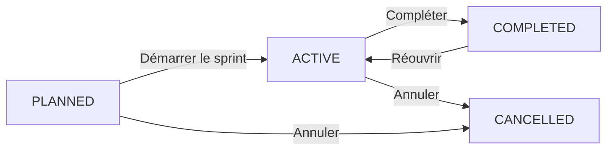

---

## 5. Diagramme d'États (State Machine Diagram)

Ce diagramme décrit les différents états possibles des entités et les transitions autorisées : cycle de vie d'une tâche (NEW → TODO → IN_PROGRESS → IN_REVIEW → DONE), d'un sprint (PLANNED → ACTIVE → COMPLETED) et d'un epic (TODO → IN_PROGRESS → DONE).

### Task States

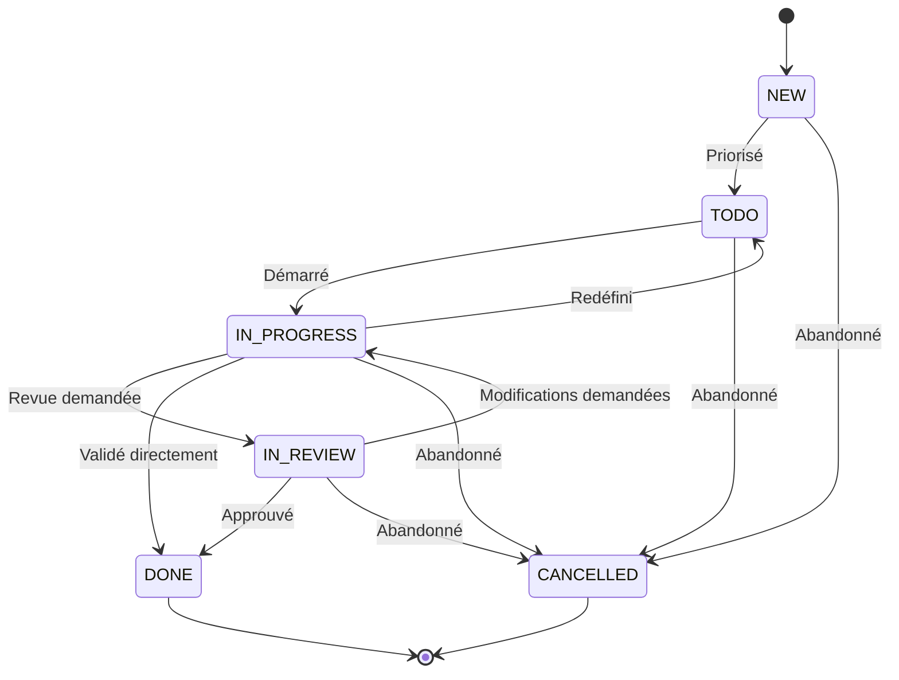

### Sprint States

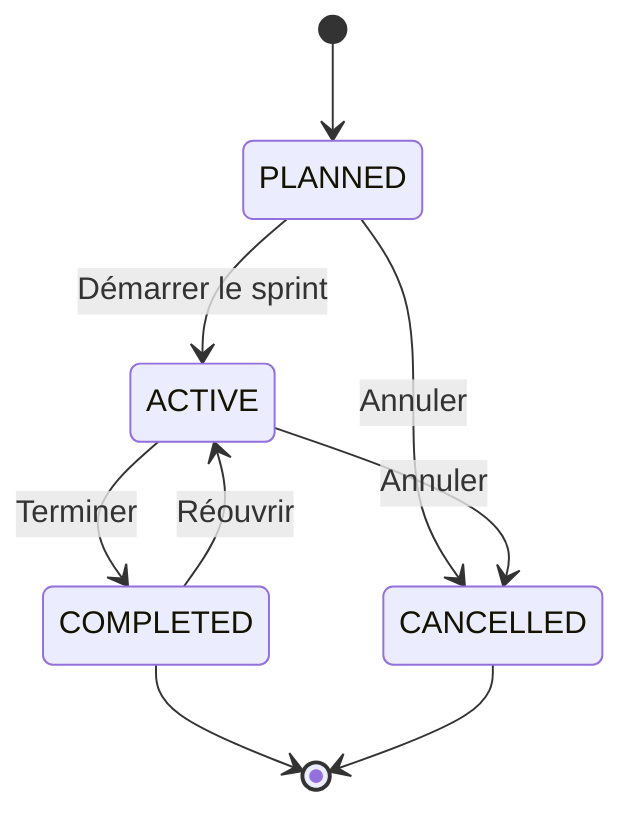

### Epic States

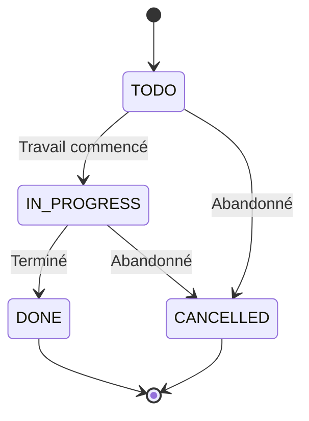

---

## 6. Diagramme de Déploiement (Deployment Diagram)

Ce diagramme représente l'architecture physique du système : le client Angular (SPA + PWA), le serveur Spring Boot (API, services, sécurité, cache), la base de données PostgreSQL, le système de fichiers pour les uploads, et les outils de monitoring (Actuator, SonarQube).

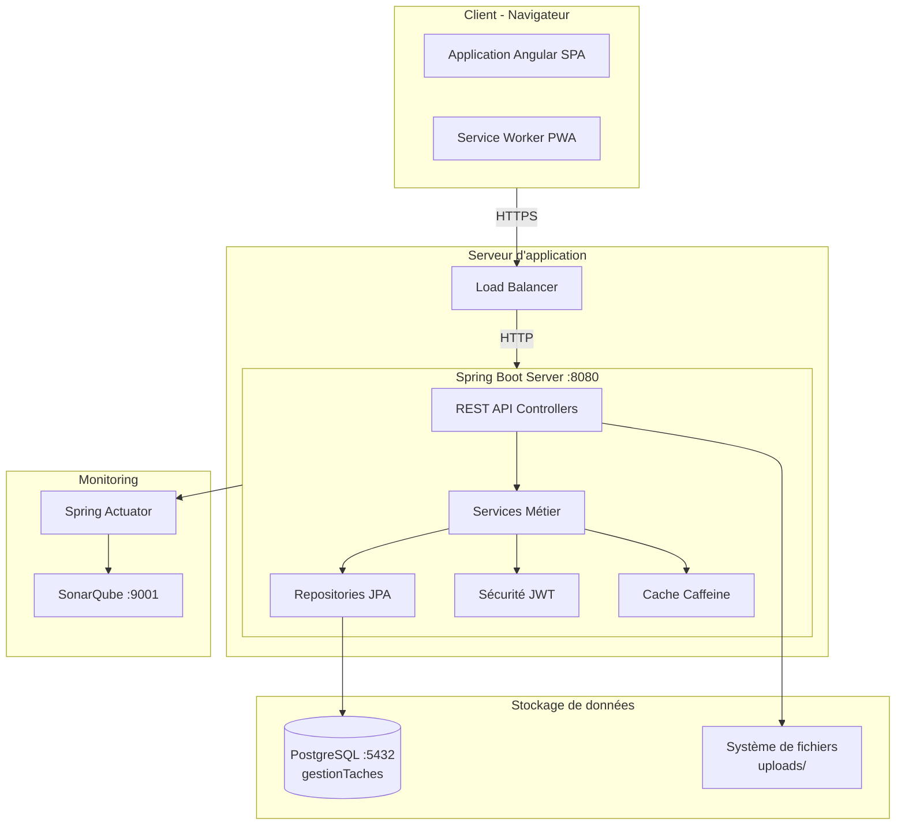

---

## 7. Diagramme de Composants (Component Diagram)

Ce diagramme montre l'organisation des modules logiciels du système : le frontend Angular (pages, services, modules partagés) et le backend Spring Boot (controllers REST, services métier, accès aux données, sécurité), ainsi que leurs interactions.

```mermaid
flowchart TD
    subgraph Frontend[Frontend Angular]
        App[Application Root]
        Router[Router]
        subgraph Pages[Pages & Composants]
            Dashboard
            Kanban
            SprintBoard
            EpicRoadmap
            TaskDetail
            Admin
        end
        subgraph Services[Services]
            TaskService
            SprintService
            ProjectService
            EpicService
            NotificationService
            AuthService
        end
        subgraph Shared[Modules Partagés]
            AlertComponent
            TranslateModule
            Pagination
            FilterComponent
        end
    end

    subgraph Backend[Backend Spring Boot]
        subgraph Controllers[REST Controllers]
            ProjectResource
            SprintResource
            EpicResource
            TaskResource
            CommentResource
            AttachmentResource
            NotificationResource
            AccountResource
        end
        subgraph ServicesLayer[Services Layer]
            ProjectService
            SprintService
            EpicService
            TaskService
            CommentService
            AttachmentService
            NotificationService
            MailService
        end
        subgraph DataAccess[Data Access]
            Repositories
            Mappers MapStruct
            DTOs
        end
        subgraph Security[Security]
            JWT
            BCrypt
            @PreAuthorize
        end
    end

    subgraph Database[Base de Données]
        Tables[Tables JPA]
        Liquibase[Migrations Liquibase]
    end

    App --> Router
    Router --> Pages
    Pages --> Services
    Pages --> Shared
    Services --> Controllers
    Controllers --> ServicesLayer
    ServicesLayer --> DataAccess
    DataAccess --> Tables
    Security --> Controllers
    Tables --> Liquibase
```

---

## 8. Diagramme de Paquetages (Package Diagram)

Ce diagramme illustre la structure des paquetages du projet : l'organisation du backend (domain, repository, service, web.rest, config, security, aop) et du frontend (entities, core, shared, layouts, home, admin), avec leurs dépendances.

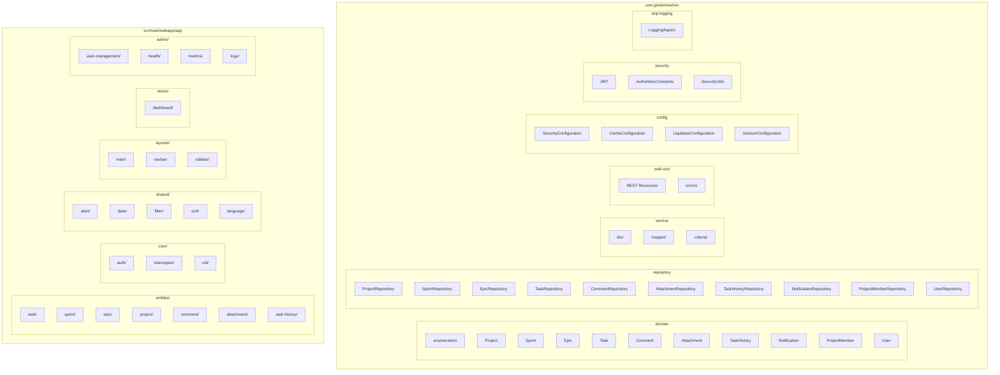

### Dépendances entre Paquetages

| Paquetage | Dépend de |
|-----------|-----------|
| `web.rest` | `service`, `security`, `repository` |
| `service` | `repository`, `domain`, `service.dto`, `service.mapper` |
| `service.dto` | `domain` |
| `service.mapper` | `domain`, `service.dto` |
| `repository` | `domain` |
| `config` | `security`, `domain` |
| `entities/` (frontend) | `core/util`, `shared/` |
| `home/dashboard` | `core/config`, `entities/` |

---

## 9. Diagramme d'Objets (Object Diagram)

Ce diagramme présente un snapshot concret d'instances du système à un moment donné : un projet "Site Web" avec ses sprints, epics, tâches, commentaires et utilisateurs, illustrant les relations entre objets réels.

### Exemple d'instances en cours d'exécution

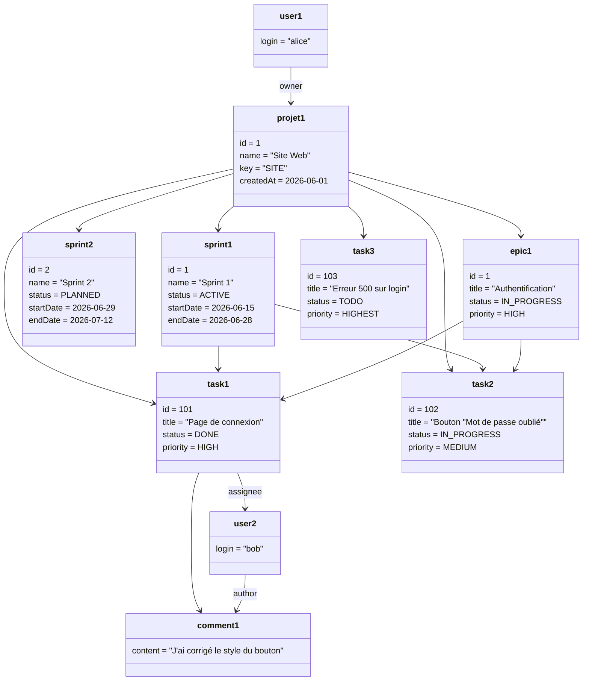

---

## 10. Diagramme de Communication (Communication Diagram)

Ce diagramme montre les interactions entre les objets et acteurs lors de la création d'un commentaire sur une tâche, en mettant l'accent sur l'ordre des messages échangés (de l'ouverture de la tâche jusqu'à l'affichage du commentaire).

### Création d'un commentaire sur une tâche


---

## 11. Diagramme de Timing (Timing Diagram)

Ce diagramme illustre l'évolution temporelle d'un sprint sur 20 jours, du démarrage (PLANNED → ACTIVE) jusqu'à la complétion, en passant par les jalons clés (développement, revue, validation). Un tableau associé détaille les métriques temporelles d'une tâche.

### Cycle de vie d'un Sprint (20 jours)

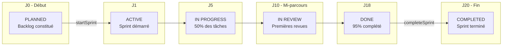

### Métriques temporelles d'une Tâche

| Jour | Événement | Statut | Commentaire |
|------|-----------|--------|-------------|
| J0 | Création | NEW | Tâche créée |
| J3 | Priorisation | TODO | Ajoutée au sprint courant |
| J5 | Développement | IN_PROGRESS | Travail commencé |
| J9 | Code review | IN_REVIEW | Pull request soumise |
| J10 | Validation | DONE | Merge effectué |
| J20 | Fin de sprint | DONE | Sprint complété |

---

## 12. Diagramme de Structure Composite (Composite Structure Diagram)

Ce diagramme décompose la structure interne d'une Task : ses propriétés (titre, statut, priorité), ses parties (commentaires, pièces jointes, historique) et ses références externes (projet, sprint, epic, assignee). Un tableau décrit les ports et interfaces associés.

### Structure interne d'une Task

```mermaid
flowchart TD
    subgraph Task[Task #id]
        direction LR
        subgraph Props[Propriétés]
            title
            description
            status
            priority
            createdAt
            updatedAt
        end
        subgraph Parts[Parties]
            CommentList[comments: Comment[]]
            AttachmentList[attachments: Attachment[]]
            HistoryList[history: TaskHistory[]]
        end
        subgraph Refs[Références Externes]
            Proj[project: Project]
            Spr[sprint: Sprint]
            Ep[epic: Epic]
            Assign[assignee: User]
        end
    end

    Props --- Parts
    Parts --- Refs
```

### Ports et Interfaces

| Port | Interface | Connecteur |
|------|-----------|------------|
| `TaskResource` | `REST: /api/tasks` | HTTP |
| `TaskService` | `TaskDTO ↔ Task` | MapStruct |
| `TaskRepository` | `JPA Repository` | Hibernate |
| `NotificationService` | `assign()` | Événement |

---

## 13. Diagramme de Profils (Profile Diagram)

Ce diagramme définit les stéréotypes UML personnalisés utilisés dans le projet (Entity, Service, RestController, DTO, Enum) avec leurs tags associés, et montre leur application aux classes concrètes du système.

### Stéréotypes et Tags appliqués au projet

```mermaid
classDiagram
    class <<stereotype>> Entity {
        +tableName: String
        +changelogDate: String
        +service: String = "serviceClass"
        +dto: String = "mapstruct"
        +pagination: String
    }

    class <<stereotype>> Service {
        +logging: boolean = true
        +transactional: boolean = true
    }

    class <<stereotype>> RestController {
        +basePath: String
        +entityName: String
    }

    class <<stereotype>> DTO {
        +mapstruct: boolean = true
    }

    class <<stereotype>> Enum

    Entity <|-- Project
    Entity <|-- Sprint
    Entity <|-- Epic
    Entity <|-- Task
    Entity <|-- Comment
    Entity <|-- Attachment
    Entity <|-- TaskHistory

    Service <|-- ProjectService
    Service <|-- SprintService
    Service <|-- TaskService

    RestController <|-- ProjectResource
    RestController <|-- SprintResource
    RestController <|-- TaskResource

    DTO <|-- ProjectDTO
    DTO <|-- TaskDTO

    Enum <|-- TaskStatus
    Enum <|-- SprintStatus
    Enum <|-- Priority
    Enum <|-- EpicStatus
    Enum <|-- ProjectRole
```

### Contraintes UML

| Stéréotype | Cible | Tags |
|------------|-------|------|
| `Entity` | Classes du package `domain/` | `tableName`, `changelogDate`, `service`, `dto`, `pagination` |
| `Service` | Classes du package `service/` | `logging`, `transactional` |
| `RestController` | Classes du package `web/rest/` | `basePath`, `entityName` |
| `DTO` | Classes du package `service/dto/` | `mapstruct` |
| `Enum` | Classes du package `domain/enumeration/` | — |

---

## 14. Diagramme de Vue d'Ensemble des Interactions (Interaction Overview Diagram)

Ce diagramme offre une vue d'ensemble du flux de création d'une tâche, combinant sous-diagrammes (création, commentaire, upload de fichier) et une référence vers un diagramme de séquence externe (assignation), permettant de visualiser un processus complet.

### Création d'une tâche avec commentaire et pièce jointe

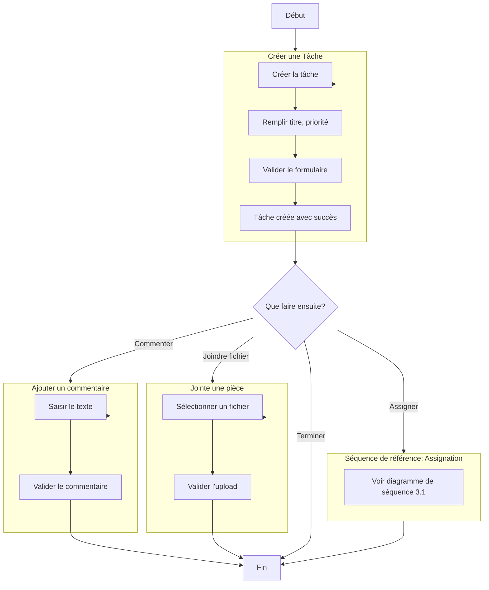

Ce diagramme combine plusieurs diagrammes de séquence et d'activité pour montrer un flux de travail complet.

---

## Tableau récapitulatif des 14 diagrammes UML

| # | Diagramme UML | Type | Outil utilisé | Fichier/Package couvert |
|---|---|---|---|---|
| 1 | Diagramme de classes | Structure | Mermaid `classDiagram` | `domain/`, `domain/enumeration/` |
| 2 | Diagramme de cas d'utilisation | Comportement | Mermaid `graph` + `fa:fa-user` | Fonctionnalités du système |
| 3 | Diagramme de séquence | Comportement | Mermaid `sequenceDiagram` | Assignation, création projet, Kanban |
| 4 | Diagramme d'activité | Comportement | Mermaid `flowchart` | Cycle de vie tâche, processus sprint |
| 5 | Diagramme d'états | Comportement | Mermaid `stateDiagram-v2` | Task, Sprint, Epic |
| 6 | Diagramme de déploiement | Structure | Mermaid `flowchart` | Architecture physique |
| 7 | Diagramme de composants | Structure | Mermaid `flowchart` | Modules Angular + Spring |
| 8 | Diagramme de paquetages | Structure | Mermaid `flowchart` | Structure des packages |
| 9 | Diagramme d'objets | Structure | Mermaid `classDiagram` | Instances d'exemple |
| 10 | Diagramme de communication | Comportement | Mermaid `sequenceDiagram` | Création d'un commentaire |
| 11 | Diagramme de timing | Comportement | Mermaid `flowchart` | Cycle de sprint + métriques |
| 12 | Diagramme de structure composite | Structure | Mermaid `flowchart` | Structure interne d'une Task |
| 13 | Diagramme de profils | Structure | Mermaid `classDiagram` | Stéréotypes JHipster |
| 14 | Diagramme de vue d'ensemble des interactions | Comportement | Mermaid `flowchart` | Flux complet création tâche |

---

## Rôle de Chaque Table et Structure de la Base de Données

### `jhi_user`

Table gérée par JHipster. Contient les comptes utilisateurs avec authentification.

| Colonne | Type | Contraintes |
|---------|------|-------------|
| `id` | `bigint` | PRIMARY KEY |
| `login` | `varchar(50)` | UNIQUE, NOT NULL |
| `password_hash` | `varchar(60)` | NOT NULL (BCrypt) |
| `first_name` | `varchar(50)` | |
| `last_name` | `varchar(50)` | |
| `email` | `varchar(191)` | UNIQUE |
| `image_url` | `varchar(256)` | |
| `activated` | `boolean` | NOT NULL, default `false` |
| `lang_key` | `varchar(10)` | |
| `activation_key` | `varchar(20)` | |
| `reset_key` | `varchar(20)` | |
| `reset_date` | `timestamp` | |
| `created_by` | `varchar(50)` | NOT NULL |
| `created_date` | `timestamp` | |
| `last_modified_by` | `varchar(50)` | |
| `last_modified_date` | `timestamp` | |

### `jhi_authority`

Table des rôles/autorités. Le nom du rôle sert de clé primaire.

| Colonne | Type | Contraintes |
|---------|------|-------------|
| `name` | `varchar(50)` | PRIMARY KEY |

### `jhi_user_authority`

Table de jointure entre utilisateurs et rôles (ManyToMany).

| Colonne | Type | Contraintes |
|---------|------|-------------|
| `user_id` | `bigint` | FK → `jhi_user(id)` |
| `authority_name` | `varchar(50)` | FK → `jhi_authority(name)` |
| | | PRIMARY KEY composite (`user_id`, `authority_name`) |

### `project`

Table racine du système. Représente un projet. Contient les sprints, epics et tâches. Un `project_key` unique sert d'identifiant court (ex. `PROJ`). Chaque projet a un propriétaire (`owner_id` → `jhi_user`) et une équipe via la table `project_member`.

| Colonne | Type | Contraintes |
|---------|------|-------------|
| `id` | `bigint` | PRIMARY KEY |
| `name` | `varchar(100)` | NOT NULL |
| `description` | `varchar(500)` | |
| `project_key` | `varchar(10)` | NOT NULL, UNIQUE |
| `created_at` | `datetime` | NOT NULL |
| `owner_id` | `bigint` | FK → `jhi_user(id)` |

### `project_member`

Table de jointure enrichie entre Project et User. Remplace l'ancienne table de jointure `project_members`. Chaque entrée possède un identifiant, un rôle (`ProjectRole` : `OWNER`, `MANAGER`, `MEMBER`) et une date d'ajout. Contrainte d'unicité sur `(project_id, user_id)`.

| Colonne | Type | Contraintes |
|---------|------|-------------|
| `id` | `bigint` | PRIMARY KEY |
| `project_id` | `bigint` | FK → `project(id)`, NOT NULL |
| `user_id` | `bigint` | FK → `jhi_user(id)`, NOT NULL |
| `role` | `varchar(50)` | NOT NULL (`OWNER`/`MANAGER`/`MEMBER`) |
| `joined_at` | `datetime(6)` | NOT NULL |
| | | UNIQUE(`project_id`, `user_id`) |

### `sprint`

Itération de développement dans un projet. Regroupe un ensemble de tâches à réaliser sur une période donnée. Peut être PLANNED, ACTIVE, COMPLETED ou CANCELLED.

| Colonne | Type | Contraintes |
|---------|------|-------------|
| `id` | `bigint` | PRIMARY KEY |
| `name` | `varchar(100)` | NOT NULL |
| `goal` | `varchar(500)` | |
| `start_date` | `date` | |
| `end_date` | `date` | |
| `status` | `varchar(255)` | NOT NULL (`PLANNED`/`ACTIVE`/`COMPLETED`/`CANCELLED`) |
| `project_id` | `bigint` | FK → `project(id)`, NOT NULL |

### `epic`

Regroupement logique de tâches correspondant à une fonctionnalité transverse de grande envergure. Permet de suivre un objectif métier à travers plusieurs sprints.

| Colonne | Type | Contraintes |
|---------|------|-------------|
| `id` | `bigint` | PRIMARY KEY |
| `title` | `varchar(200)` | NOT NULL |
| `description` | `varchar(1000)` | |
| `status` | `varchar(255)` | NOT NULL (`TODO`/`IN_PROGRESS`/`DONE`/`CANCELLED`) |
| `priority` | `varchar(255)` | NOT NULL (`LOWEST`/`LOW`/`MEDIUM`/`HIGH`/`HIGHEST`) |
| `created_at` | `datetime` | NOT NULL |
| `updated_at` | `datetime` | |
| `start_date` | `date` | |
| `end_date` | `date` | |
| `project_id` | `bigint` | FK → `project(id)`, NOT NULL |

### `task`

Unité de travail atomique. Suit un cycle de vie complet (NEW → TODO → IN_PROGRESS → IN_REVIEW → DONE). Liée à un projet (obligatoire), un sprint (optionnel) et/ou un epic (optionnel). Possède un assignee et un créateur.

| Colonne | Type | Contraintes |
|---------|------|-------------|
| `id` | `bigint` | PRIMARY KEY |
| `title` | `varchar(200)` | NOT NULL |
| `description` | `varchar(5000)` | |
| `status` | `varchar(255)` | NOT NULL (`NEW`/`TODO`/`IN_PROGRESS`/`IN_REVIEW`/`DONE`/`CANCELLED`) |
| `priority` | `varchar(255)` | NOT NULL (`LOWEST`/`LOW`/`MEDIUM`/`HIGH`/`HIGHEST`) |
| `created_at` | `datetime` | NOT NULL |
| `updated_at` | `datetime` | |
| `sprint_id` | `bigint` | FK → `sprint(id)` |
| `epic_id` | `bigint` | FK → `epic(id)` |
| `project_id` | `bigint` | FK → `project(id)`, NOT NULL |
| `assignee_id` | `bigint` | FK → `jhi_user(id)` |
| `created_by_id` | `bigint` | FK → `jhi_user(id)` |

### `comment`

Commentaire texte attaché à une tâche. Possède un auteur (`author_id` → `jhi_user`). Permet la discussion et le suivi collaboratif.

| Colonne | Type | Contraintes |
|---------|------|-------------|
| `id` | `bigint` | PRIMARY KEY |
| `content` | `varchar(2000)` | NOT NULL |
| `created_at` | `datetime` | NOT NULL |
| `task_id` | `bigint` | FK → `task(id)`, NOT NULL |
| `author_id` | `bigint` | FK → `jhi_user(id)` |

### `attachment`

Fichier joint à une tâche (capture d'écran, document, etc.). Stocke le chemin du fichier et son nom original.

| Colonne | Type | Contraintes |
|---------|------|-------------|
| `id` | `bigint` | PRIMARY KEY |
| `file_name` | `varchar(255)` | NOT NULL |
| `file_path` | `varchar(1000)` | NOT NULL |
| `uploaded_at` | `datetime` | NOT NULL |
| `task_id` | `bigint` | FK → `task(id)`, NOT NULL |

### `task_history`

Trace d'audit détaillant chaque modification d'une tâche. Enregistre l'action effectuée, l'ancienne et la nouvelle valeur, ainsi que l'utilisateur ayant effectué la modification.

| Colonne | Type | Contraintes |
|---------|------|-------------|
| `id` | `bigint` | PRIMARY KEY |
| `action` | `varchar(100)` | NOT NULL |
| `old_value` | `varchar(500)` | |
| `new_value` | `varchar(500)` | |
| `created_at` | `datetime` | NOT NULL |
| `task_id` | `bigint` | FK → `task(id)`, NOT NULL |
| `user_id` | `bigint` | FK → `jhi_user(id)`, NOT NULL |

### `notification`

Notification in-app pour informer un utilisateur (ex: assignation à une tâche). Contient un message, une référence vers la tâche et un statut de lecture.

| Colonne | Type | Contraintes |
|---------|------|-------------|
| `id` | `bigint` | PRIMARY KEY, auto-increment |
| `message` | `varchar(500)` | NOT NULL |
| `task_id` | `bigint` | FK → `task(id)` |
| `task_title` | `varchar(200)` | |
| `user_id` | `bigint` | FK → `jhi_user(id)`, NOT NULL |
| `is_read` | `boolean` | NOT NULL, default `false` |
| `created_at` | `datetime(6)` | NOT NULL |

---

## Énumérations

| Enum | Valeurs | Utilisée par |
|------|---------|-------------|
| `SprintStatus` | `PLANNED`, `ACTIVE`, `COMPLETED`, `CANCELLED` | Sprint |
| `EpicStatus` | `TODO`, `IN_PROGRESS`, `DONE`, `CANCELLED` | Epic |
| `TaskStatus` | `NEW`, `TODO`, `IN_PROGRESS`, `IN_REVIEW`, `DONE`, `CANCELLED` | Task |
| `Priority` | `LOWEST`, `LOW`, `MEDIUM`, `HIGH`, `HIGHEST` | Task, Epic |
| `ProjectRole` | `OWNER`, `MANAGER`, `MEMBER` | ProjectMember |

---

## Dépendances entre Tables

| Table | Dépend de | Est utilisé par |
|-------|-----------|-----------------|
| jhi_user | — | Project (owner), ProjectMember, Task (assignee, createdBy), Comment (author), TaskHistory (user), Notification (user) |
| jhi_authority | — | jhi_user_authority |
| jhi_user_authority | jhi_user, jhi_authority | — |
| project | jhi_user (owner) | Sprint, Epic, Task, ProjectMember |
| project_member | project, jhi_user | — |
| sprint | project | Task |
| epic | project | Task |
| task | project, sprint, epic, jhi_user (assignee, createdBy) | Comment, Attachment, TaskHistory, Notification |
| comment | task, jhi_user (author) | — |
| attachment | task | — |
| task_history | task, jhi_user (user) | — |
| notification | task, jhi_user (user) | — |
