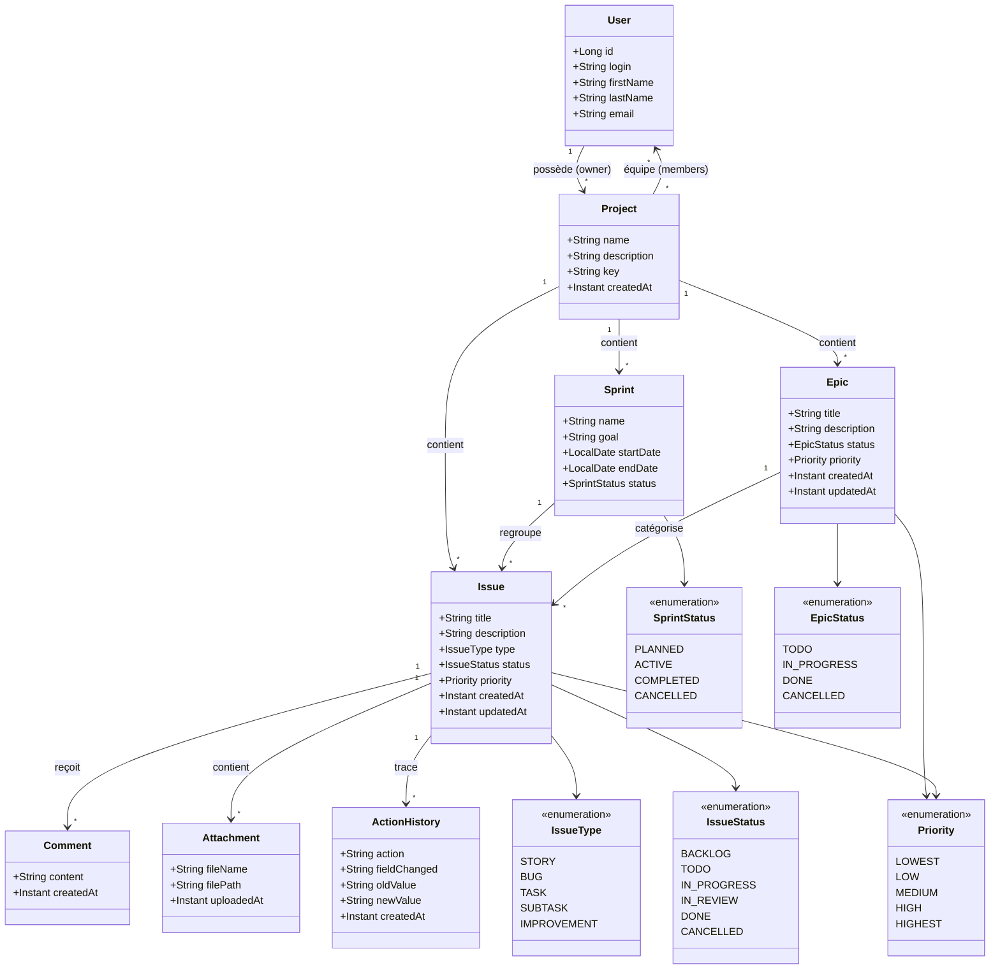

# Fiche Technique — Diagramme de Classes et Rôles des Tables

## Diagramme de Classes (Mermaid)

---

## Rôle de Chaque Table

### Project
Table racine du système. Représente un projet (ex. une application, un produit). Contient les sprints, epics et issues. Un `key` unique sert d'identifiant court (ex. `PROJ`). Chaque projet a un propriétaire (`owner_id` → `jhi_user`) et une équipe (`project_members`).

### Sprint
Itération de développement dans un projet. Regroupe un ensemble d'issues à réaliser sur une période donnée. Peut être PLANIFIÉ, ACTIF, TERMINÉ ou ANNULÉ.

### Epic
Regroupement logique d'issues correspondant à une fonctionnalité transverse de grande envergure. Permet de suivre un objectif métier à travers plusieurs sprints.

### Issue
Unité de travail atomique. Peut être un Story, Bug, Task, Subtask ou Improvement. Suit un cycle de vie complet (BACKLOG → DONE). Liée à un sprint et/ou un epic.

### Comment
Commentaire texte attaché à une issue. Permet la discussion et le suivi collaboratif.

### Attachment
Fichier joint à une issue (capture d'écran, document, etc.). Stocke le chemin du fichier et son nom original.

### ActionHistory
Trace d'audit détaillant chaque modification d'une issue. Enregistre l'action, le champ modifié, l'ancienne et la nouvelle valeur.

---

## Dépendances entre Tables

| Table | Dépend de | Est utilisé par |
|-------|-----------|-----------------|
| User | — | Project (owner, members) |
| Project | User (owner) | Sprint, Epic, Issue |
| Sprint | Project | Issue |
| Epic | Project | Issue |
| Issue | Project, Sprint, Epic | Comment, Attachment, ActionHistory |
| Comment | Issue | — |
| Attachment | Issue | — |
| ActionHistory | Issue | — |
| project_members | Project, User | — |
