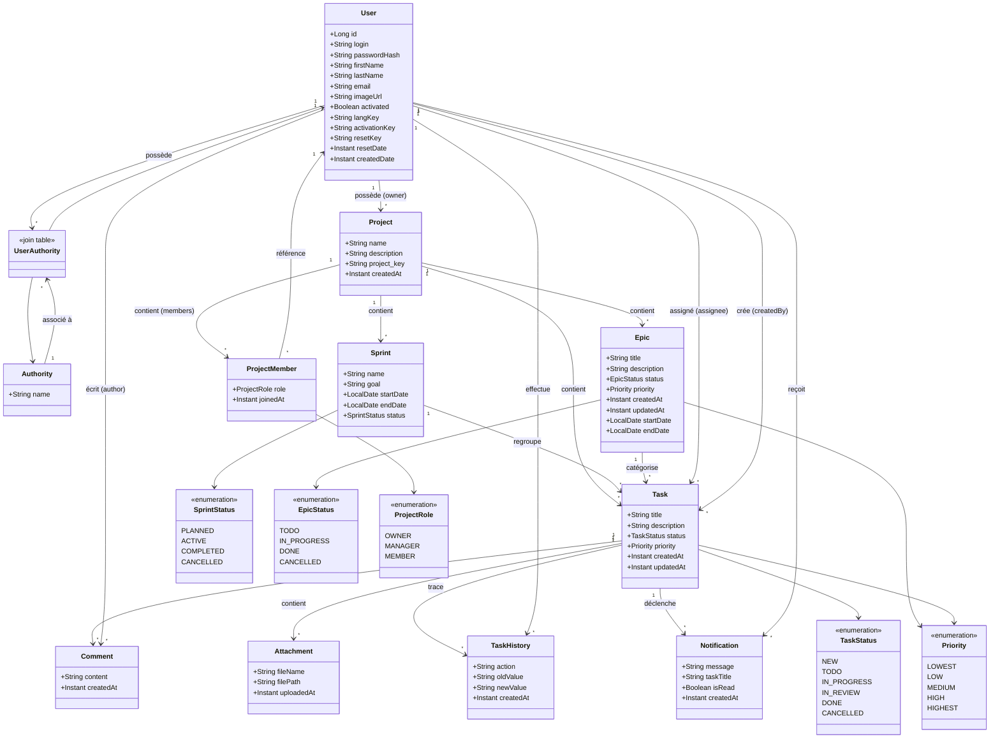
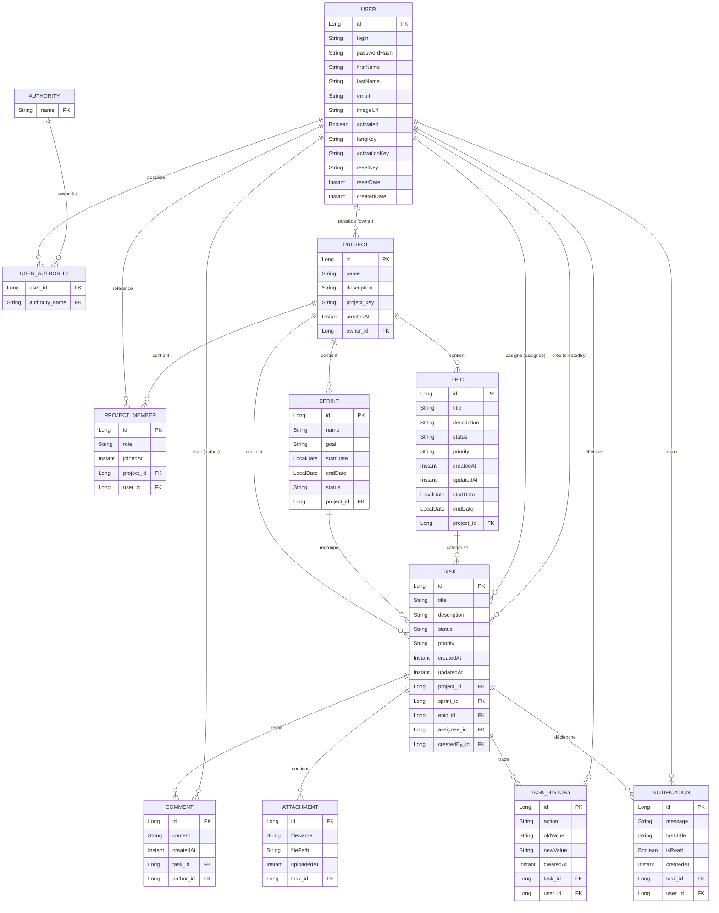

# Fiche Technique — Diagrammes UML du Projet

## 1. Diagramme de Classes (Class Diagram)

Ce diagramme modélise la structure statique du système : les entités métier (User, Project, Task, etc.), leurs attributs, leurs types (enumérations) et les associations qui les relient (propriétaire, membres, sprint, epic, commentaires, etc.).

---
## 2. Diagramme Entité-Relation

---

## Rôle de Chaque Table et Structure de la Base de Données

### `jhi_user`

Table gérée par JHipster. Contient les comptes utilisateurs avec authentification.

| Colonne | Type | Contraintes |
|---------|------|-------------|
| `id` | `bigint` | PRIMARY KEY |
| `login` | `varchar(50)` | UNIQUE, NOT NULL |
| `password_hash` | `varchar(60)` | NOT NULL (BCrypt) |
| `first_name` | `varchar(50)` | |
| `last_name` | `varchar(50)` | |
| `email` | `varchar(191)` | UNIQUE |
| `image_url` | `varchar(256)` | |
| `activated` | `boolean` | NOT NULL, default `false` |
| `lang_key` | `varchar(10)` | |
| `activation_key` | `varchar(20)` | |
| `reset_key` | `varchar(20)` | |
| `reset_date` | `timestamp` | |
| `created_by` | `varchar(50)` | NOT NULL |
| `created_date` | `timestamp` | |
| `last_modified_by` | `varchar(50)` | |
| `last_modified_date` | `timestamp` | |

### `jhi_authority`

Table des rôles/autorités. Le nom du rôle sert de clé primaire.

| Colonne | Type | Contraintes |
|---------|------|-------------|
| `name` | `varchar(50)` | PRIMARY KEY |

### `jhi_user_authority`

Table de jointure entre utilisateurs et rôles (ManyToMany).

| Colonne | Type | Contraintes |
|---------|------|-------------|
| `user_id` | `bigint` | FK → `jhi_user(id)` |
| `authority_name` | `varchar(50)` | FK → `jhi_authority(name)` |
| | | PRIMARY KEY composite (`user_id`, `authority_name`) |

### `project`

Table racine du système. Représente un projet. Contient les sprints, epics et tâches. Un `project_key` unique sert d'identifiant court (ex. `PROJ`). Chaque projet a un propriétaire (`owner_id` → `jhi_user`) et une équipe via la table `project_member`.

| Colonne | Type | Contraintes |
|---------|------|-------------|
| `id` | `bigint` | PRIMARY KEY |
| `name` | `varchar(100)` | NOT NULL |
| `description` | `varchar(500)` | |
| `project_key` | `varchar(10)` | NOT NULL, UNIQUE |
| `created_at` | `datetime` | NOT NULL |
| `owner_id` | `bigint` | FK → `jhi_user(id)` |

### `project_member`

Table de jointure enrichie entre Project et User. Remplace l'ancienne table de jointure `project_members`. Chaque entrée possède un identifiant, un rôle (`ProjectRole` : `OWNER`, `MANAGER`, `MEMBER`) et une date d'ajout. Contrainte d'unicité sur `(project_id, user_id)`.

| Colonne | Type | Contraintes |
|---------|------|-------------|
| `id` | `bigint` | PRIMARY KEY |
| `project_id` | `bigint` | FK → `project(id)`, NOT NULL |
| `user_id` | `bigint` | FK → `jhi_user(id)`, NOT NULL |
| `role` | `varchar(50)` | NOT NULL (`OWNER`/`MANAGER`/`MEMBER`) |
| `joined_at` | `datetime(6)` | NOT NULL |
| | | UNIQUE(`project_id`, `user_id`) |

### `sprint`

Itération de développement dans un projet. Regroupe un ensemble de tâches à réaliser sur une période donnée. Peut être PLANNED, ACTIVE, COMPLETED ou CANCELLED.

| Colonne | Type | Contraintes |
|---------|------|-------------|
| `id` | `bigint` | PRIMARY KEY |
| `name` | `varchar(100)` | NOT NULL |
| `goal` | `varchar(500)` | |
| `start_date` | `date` | |
| `end_date` | `date` | |
| `status` | `varchar(255)` | NOT NULL (`PLANNED`/`ACTIVE`/`COMPLETED`/`CANCELLED`) |
| `project_id` | `bigint` | FK → `project(id)`, NOT NULL |

### `epic`

Regroupement logique de tâches correspondant à une fonctionnalité transverse de grande envergure. Permet de suivre un objectif métier à travers plusieurs sprints.

| Colonne | Type | Contraintes |
|---------|------|-------------|
| `id` | `bigint` | PRIMARY KEY |
| `title` | `varchar(200)` | NOT NULL |
| `description` | `varchar(1000)` | |
| `status` | `varchar(255)` | NOT NULL (`TODO`/`IN_PROGRESS`/`DONE`/`CANCELLED`) |
| `priority` | `varchar(255)` | NOT NULL (`LOWEST`/`LOW`/`MEDIUM`/`HIGH`/`HIGHEST`) |
| `created_at` | `datetime` | NOT NULL |
| `updated_at` | `datetime` | |
| `start_date` | `date` | |
| `end_date` | `date` | |
| `project_id` | `bigint` | FK → `project(id)`, NOT NULL |

### `task`

Unité de travail atomique. Suit un cycle de vie complet (NEW → TODO → IN_PROGRESS → IN_REVIEW → DONE). Liée à un projet (obligatoire), un sprint (optionnel) et/ou un epic (optionnel). Possède un assignee et un créateur.

| Colonne | Type | Contraintes |
|---------|------|-------------|
| `id` | `bigint` | PRIMARY KEY |
| `title` | `varchar(200)` | NOT NULL |
| `description` | `varchar(5000)` | |
| `status` | `varchar(255)` | NOT NULL (`NEW`/`TODO`/`IN_PROGRESS`/`IN_REVIEW`/`DONE`/`CANCELLED`) |
| `priority` | `varchar(255)` | NOT NULL (`LOWEST`/`LOW`/`MEDIUM`/`HIGH`/`HIGHEST`) |
| `created_at` | `datetime` | NOT NULL |
| `updated_at` | `datetime` | |
| `sprint_id` | `bigint` | FK → `sprint(id)` |
| `epic_id` | `bigint` | FK → `epic(id)` |
| `project_id` | `bigint` | FK → `project(id)`, NOT NULL |
| `assignee_id` | `bigint` | FK → `jhi_user(id)` |
| `created_by_id` | `bigint` | FK → `jhi_user(id)` |

### `comment`

Commentaire texte attaché à une tâche. Possède un auteur (`author_id` → `jhi_user`). Permet la discussion et le suivi collaboratif.

| Colonne | Type | Contraintes |
|---------|------|-------------|
| `id` | `bigint` | PRIMARY KEY |
| `content` | `varchar(2000)` | NOT NULL |
| `created_at` | `datetime` | NOT NULL |
| `task_id` | `bigint` | FK → `task(id)`, NOT NULL |
| `author_id` | `bigint` | FK → `jhi_user(id)` |

### `attachment`

Fichier joint à une tâche (capture d'écran, document, etc.). Stocke le chemin du fichier et son nom original.

| Colonne | Type | Contraintes |
|---------|------|-------------|
| `id` | `bigint` | PRIMARY KEY |
| `file_name` | `varchar(255)` | NOT NULL |
| `file_path` | `varchar(1000)` | NOT NULL |
| `uploaded_at` | `datetime` | NOT NULL |
| `task_id` | `bigint` | FK → `task(id)`, NOT NULL |

### `task_history`

Trace d'audit détaillant chaque modification d'une tâche. Enregistre l'action effectuée, l'ancienne et la nouvelle valeur, ainsi que l'utilisateur ayant effectué la modification.

| Colonne | Type | Contraintes |
|---------|------|-------------|
| `id` | `bigint` | PRIMARY KEY |
| `action` | `varchar(100)` | NOT NULL |
| `old_value` | `varchar(500)` | |
| `new_value` | `varchar(500)` | |
| `created_at` | `datetime` | NOT NULL |
| `task_id` | `bigint` | FK → `task(id)`, NOT NULL |
| `user_id` | `bigint` | FK → `jhi_user(id)`, NOT NULL |

### `notification`

Notification in-app pour informer un utilisateur (ex: assignation à une tâche). Contient un message, une référence vers la tâche et un statut de lecture.

| Colonne | Type | Contraintes |
|---------|------|-------------|
| `id` | `bigint` | PRIMARY KEY, auto-increment |
| `message` | `varchar(500)` | NOT NULL |
| `task_id` | `bigint` | FK → `task(id)` |
| `task_title` | `varchar(200)` | |
| `user_id` | `bigint` | FK → `jhi_user(id)`, NOT NULL |
| `is_read` | `boolean` | NOT NULL, default `false` |
| `created_at` | `datetime(6)` | NOT NULL |

---

## Énumérations

| Enum | Valeurs | Utilisée par |
|------|---------|-------------|
| `SprintStatus` | `PLANNED`, `ACTIVE`, `COMPLETED`, `CANCELLED` | Sprint |
| `EpicStatus` | `TODO`, `IN_PROGRESS`, `DONE`, `CANCELLED` | Epic |
| `TaskStatus` | `NEW`, `TODO`, `IN_PROGRESS`, `IN_REVIEW`, `DONE`, `CANCELLED` | Task |
| `Priority` | `LOWEST`, `LOW`, `MEDIUM`, `HIGH`, `HIGHEST` | Task, Epic |
| `ProjectRole` | `OWNER`, `MANAGER`, `MEMBER` | ProjectMember |

---

## Dépendances entre Tables

| Table | Dépend de | Est utilisé par |
|-------|-----------|-----------------|
| jhi_user | — | Project (owner), ProjectMember, Task (assignee, createdBy), Comment (author), TaskHistory (user), Notification (user) |
| jhi_authority | — | jhi_user_authority |
| jhi_user_authority | jhi_user, jhi_authority | — |
| project | jhi_user (owner) | Sprint, Epic, Task, ProjectMember |
| project_member | project, jhi_user | — |
| sprint | project | Task |
| epic | project | Task |
| task | project, sprint, epic, jhi_user (assignee, createdBy) | Comment, Attachment, TaskHistory, Notification |
| comment | task, jhi_user (author) | — |
| attachment | task | — |
| task_history | task, jhi_user (user) | — |
| notification | task, jhi_user (user) | — |
