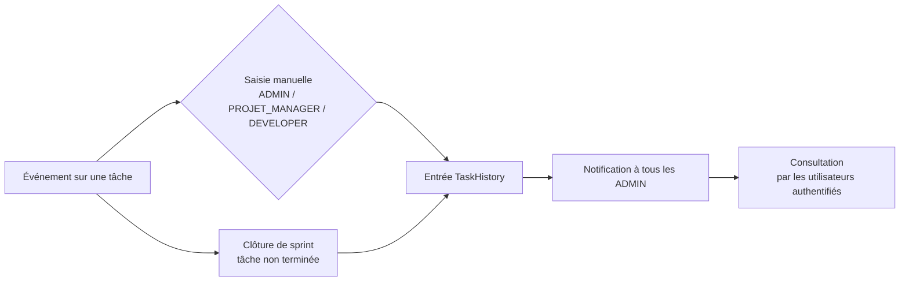

# Journal d'audit

## Vue d'ensemble

Le journal d'audit (`TaskHistory`) trace les actions marquantes sur les **tâches** : qui a fait quoi, quand, et avec quelle valeur.

### Contenu d'une entrée

| Champ | Description |
|-------|-------------|
| **Action** | Le type d'action (ex. `TASK_MOVED_TO_BACKLOG`), texte libre, 100 caractères max. |
| **Ancienne valeur** | Valeur d'origine (facultatif). |
| **Nouvelle valeur** | Nouvelle valeur (facultatif). |
| **Tâche** | La tâche concernée. |
| **Utilisateur** | L'auteur de l'action (utilisateur connecté). |
| **Date** | Horodatage de la création de l'entrée. |

## 1. Comment les entrées sont créées

### a) Déplacements automatiques (clôture de sprint)

Lors de la **clôture d'un sprint**, chaque tâche **non terminée** repoussée dans le backlog est tracée automatiquement :

| Champ | Valeur |
|-------|--------|
| Action | `TASK_MOVED_TO_BACKLOG` |
| Ancienne valeur | « Sprint: <nom du sprint> » |
| Nouvelle valeur | « Backlog » |
| Auteur | L'utilisateur qui clôture le sprint |

### b) Saisie manuelle

Toute personne disposant du rôle global `ADMIN`, `PROJET_MANAGER` ou `DEVELOPER` peut **ajouter une entrée d'audit** sur une tâche (action libre). L'auteur est automatiquement l'utilisateur connecté.

> **Point important** : les modifications ordinaires d'une tâche (titre, statut, priorité…) ne sont **pas** enregistrées automatiquement dans le journal. Seules les saisies manuelles et les déplacements au backlog y figurent. Pour un traçage systématique, il faut saisir l'entrée manuellement.

## 2. Qui peut consulter l'audit

| Accès | Qui |
|-------|-----|
| Historique d'une tâche | Tout utilisateur authentifié. |
| Liste complète des entrées | Tout utilisateur authentifié. |
| Mes 10 dernières entrées | L'utilisateur connecté (fil « activité récente » du tableau de bord développeur). |
| Une entrée précise | Tout utilisateur authentifié. |

## 3. Qui peut modifier ou supprimer l'audit

| Action | Qui |
|--------|-----|
| Ajouter une entrée | `ADMIN`, `PROJET_MANAGER`, `DEVELOPER`. |
| Modifier une entrée | `ADMIN`, `PROJET_MANAGER`, `DEVELOPER`. |
| Supprimer une entrée | `ADMIN`, `PROJET_MANAGER`, `DEVELOPER`. |

## 4. Notification des administrateurs

Chaque entrée d'audit **créée** déclenche une notification vers **tous les administrateurs** (`ADMIN`), avec le détail :

- si l'entrée a une ancienne et/ou une nouvelle valeur : `Task "titre" — ACTION (ancienne → nouvelle)` ;
- sinon : `Task "titre" — ACTION`.

## 5. Récapitulatif du cycle de l'audit

## 6. Points d'attention

- L'audit est **manuel** pour l'essentiel : son exhaustivité dépend de la discipline de saisie des équipes.
- La **suppression** d'une entrée est possible par les rôles autorisés : le journal n'est donc pas un enregistrement infalsifiable, mais un outil de traçage courant.
- Les entrées sont **supprimées avec la tâche** et avec le projet (cascade logique à la suppression).
