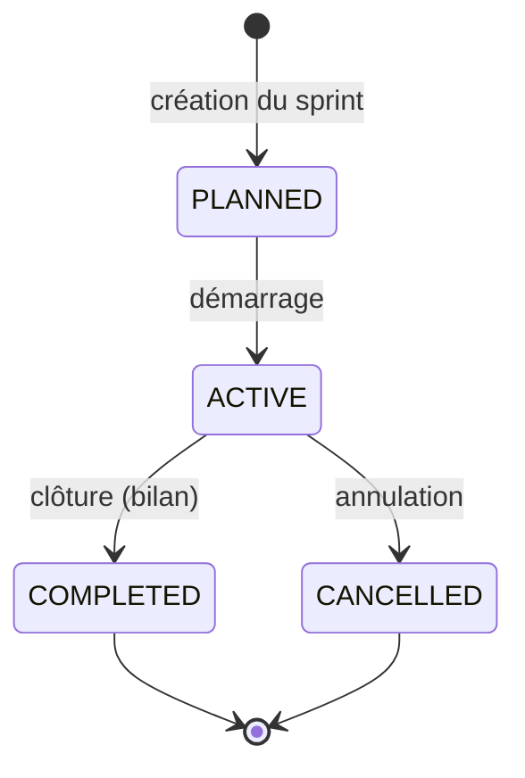
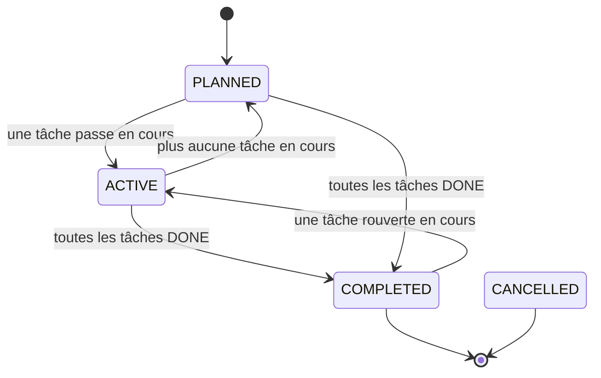

# Cycle de vie des sprints

## 1. Qu'est-ce qu'un sprint ?

Un **sprint** est une période de travail itérative dans laquelle on planifie et réalise des tâches. Il possède :

- un **nom** et une période (date de début / date de fin) ;
- un **statut** (voir ci-dessous) ;
- des **tâches** planifiées (rattachées au sprint).

Le sprint se déroule au sein d'un projet. Un projet ne peut avoir **qu'un seul sprint actif** à la fois.

## 2. Les statuts d'un sprint

| Statut | Intitulé | Signification |
|--------|----------|---------------|
| `PLANNED` | Planifié | Sprint créé, prêt à démarrer. |
| `ACTIVE` | En cours | Sprint démarré, les tâches sont travaillées. |
| `COMPLETED` | Clôturé | Sprint terminé, bilan produit. |
| `CANCELLED` | Annulé | Sprint annulé. |

## 3. Cycle de vie

### Règles de transition (imposées par l'application)

| Transition | Qui peut le faire | Conditions |
|------------|-------------------|------------|
| Créer un sprint | OWNER / MANAGER | Statut par défaut `PLANNED`. |
| `PLANNED` → `ACTIVE` | OWNER / MANAGER | Un seul sprint `ACTIVE` par projet à la fois. |
| `ACTIVE` → `COMPLETED` | OWNER / MANAGER | Le sprint doit être `ACTIVE`. |
| `ACTIVE` → `CANCELLED` | OWNER / MANAGER | Le sprint doit être `ACTIVE`. |
| Modifier un sprint | OWNER / MANAGER | Toute autre transition est refusée. |

**Statuts terminaux** : un sprint `COMPLETED` ou `CANCELLED` ne peut plus changer de statut (interdiction stricte). Seul le recalcul automatique peut réactiver un sprint `COMPLETED` (voir §5).

## 4. Déroulement concret

### 4.1 Création

À la création, tous les **membres du projet sont notifiés** (sauf le créateur) : *« Un nouveau sprint "X" a été créé dans le projet Y »*.

### 4.2 Démarrage

Seul un sprint `PLANNED` peut être démarré. Au démarrage, tous les **membres du projet sont notifiés** (sauf l'auteur) : *« Le sprint "X" a démarré »*.

### 4.3 Clôture (bilan de vélocité)

La clôture se fait uniquement depuis un sprint `ACTIVE`. Elle produit un **bilan de vélocité** :

| Indicateur | Signification |
|------------|---------------|
| Tâches prévues | Nombre total de tâches du sprint. |
| Tâches terminées | Nombre de tâches `DONE` à la clôture. |
| Pourcentage | (Tâches terminées / Tâches prévues) × 100. |
| Tâches reportées | Tâches **non terminées** repoussées au backlog. |

**Comportement à la clôture** :

1. Toutes les tâches **non `DONE`** sont **retirées du sprint** et repoussées dans le **backlog** (elles restent dans le projet, sans sprint).
2. Tous les **administrateurs sont notifiés** de ces déplacements (`TASK_MOVED_TO_BACKLOG`).
3. Le sprint passe en `COMPLETED`.

## 5. Recalcul automatique du statut

Le statut d'un sprint se recalcule **automatiquement à chaque modification de ses tâches** :

| Situation des tâches | Statut recalculé |
|----------------------|------------------|
| Au moins une tâche `IN_PROGRESS` ou `READY_FOR_TEST` | `ACTIVE` |
| Toutes les tâches `DONE` | `COMPLETED` |
| Aucune tâche en cours (mix `NEW`/`NEEDS_INFO`, ou sprint vide) | `PLANNED` |
| Sprint annulé manuellement | `CANCELLED` (jamais modifié) |

> Cas particulier : un sprint `COMPLETED` n'est **pas rétrogradé** en `PLANNED` ; il peut seulement revenir en `ACTIVE` si une tâche est remise en cours.

## 6. Le backlog

Le **backlog** est la liste des tâches du projet qui ne sont rattachées à **aucun sprint**. Il contient :

- les tâches créées sans sprint ;
- les tâches **reportées** à la clôture d'un sprint.

Le backlog est lisible par tout membre du projet. C'est de là que partent les tâches lors de la planification d'un sprint.

## 7. Suppression d'un sprint

Réservée à OWNER/MANAGER. La suppression ne supprime pas les tâches du sprint ; elles redeviennent simplement des tâches de projet (sans sprint).

## 8. Notifications associées

| Événement | Destinataires | Message |
|-----------|--------------|---------|
| Création d'un sprint | Tous les membres (sauf l'auteur) | « Un nouveau sprint "X" a été créé dans le projet Y » |
| Démarrage d'un sprint | Tous les membres (sauf l'auteur) | « Le sprint "X" a démarré » |
| Clôture : tâches reportées au backlog | Tous les ADMIN | « Task "..." — TASK_MOVED_TO_BACKLOG (...) » |

Les changements de sprint sont aussi **diffusés en temps réel** aux écrans ouverts (événements SSE).
