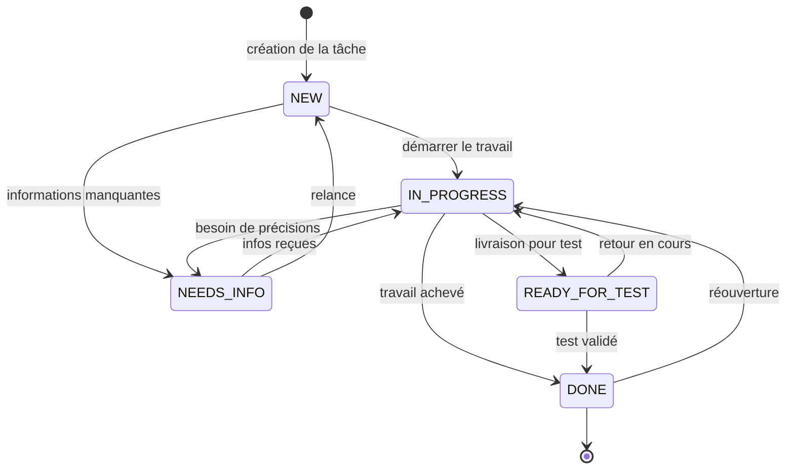
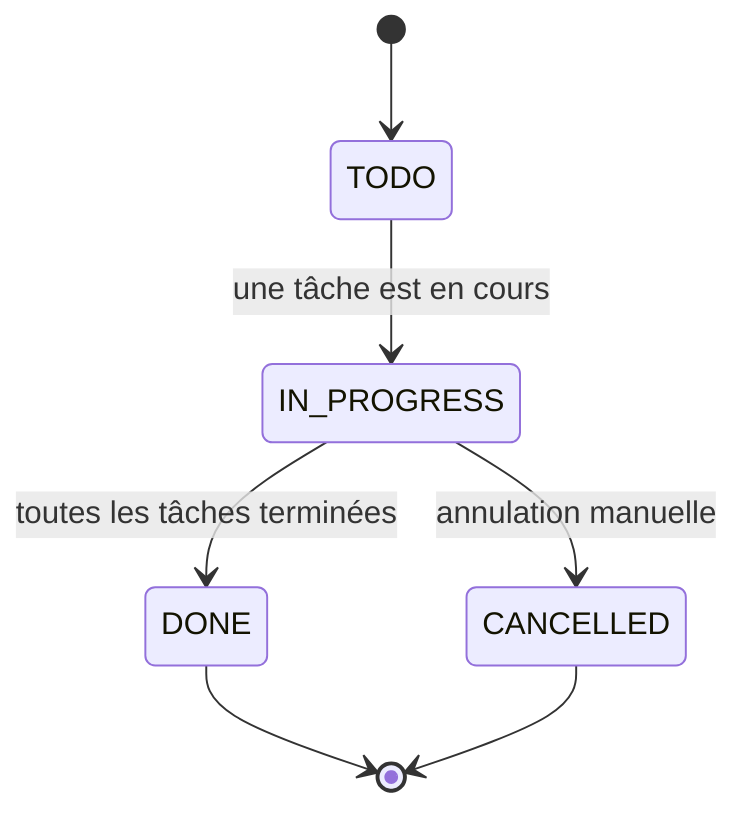

# Cycle de vie des tâches

## 1. Qu'est-ce qu'une tâche ?

Une **tâche** est l'unité de travail à réaliser au sein d'un projet. Elle est décrite par :

- un **titre** et une **description** ;
- une **priorité** (LOWEST → HIGHEST) ;
- un **statut** (voir plus bas) ;
- un **assignataire** (le membre chargé de la réaliser) ;
- un **sprint** (facultatif) et un **épic** (facultatif) de rattachement ;
- des **dates** (création, dernière modification) ;
- le **créateur** de la tâche.

> **Important** : dans cette application, une tâche n'a **pas de type**. Il n'existe pas de distinction Story / Bug / Tâche technique / Sous-tâche / Amélioration (contrairement à Jira). Toutes les tâches suivent exactement le même cycle de vie, décrit ci-dessous.

## 2. Les statuts d'une tâche

| Statut | Intitulé | Signification |
|--------|----------|---------------|
| `NEW` | Nouveau | La tâche vient d'être créée. |
| `IN_PROGRESS` | En cours | Quelqu'un travaille dessus. |
| `READY_FOR_TEST` | Prêt pour test | Le travail est livré, en attente de vérification. |
| `DONE` | Terminé | La tâche est achevée. |
| `NEEDS_INFO` | Besoin d'infos | La tâche est suspendue en attente d'informations complémentaires. |

## 3. Cycle de vie attendu

### Règles de déroulement

| Étape | Qui peut le faire | Règle |
|-------|-------------------|-------|
| Créer une tâche | OWNER / MANAGER du projet | Statut par défaut `NEW`. L'assignataire (si renseigné) doit être **membre du projet**. |
| Changer le statut d'une tâche | OWNER / MANAGER, ou le **MEMBER assigné** à la tâche | Tout changement de statut est accepté. |
| Assigner (ou réassigner) une tâche | **OWNER / MANAGER uniquement** | Le nouvel assignataire doit être membre du projet. Un MEMBER ne peut jamais réassigner. |
| Modifier titre / description / priorité | OWNER / MANAGER, ou le MEMBER assigné | La modification ne peut pas changer l'assignataire. |
| Supprimer une tâche | **OWNER / MANAGER uniquement** | Même le créateur ou l'assignataire (s'il est MEMBER) ne peut pas la supprimer. |

> **Souplesse du workflow** : l'application **n'impose pas** de chemin de statut strict pour les tâches. Tous les changements de statut sont acceptés à tout moment (y compris passer directement de `NEW` à `DONE`, ou rouvrir une tâche terminée). Le diagramme ci-dessus représente le **déroulement attendu** côté métier.

## 4. Effets automatiques d'un changement de statut

Chaque changement de statut (ou modification de la tâche) déclenche automatiquement :

1. **Recalcul du sprint parent** : si le sprint contient une tâche `IN_PROGRESS` ou `READY_FOR_TEST`, il passe à `ACTIVE` ; si **toutes** ses tâches sont `DONE`, il passe à `COMPLETED` (voir [cycle-de-vie-sprint.md](./cycle-de-vie-sprint.md)).
2. **Recalcul de l'épic parent** : même logique (`IN_PROGRESS` / `DONE`) ; voir §6.
3. **Notifications** : l'assignataire est informé du changement de statut, et le nouveau statut `DONE` notifie spécifiquement le créateur et/ou l'assignataire s'ils sont administrateurs (voir [notifications.md](./notifications.md)).

### Statut `DONE` : statut final

Le statut `DONE` a une place particulière :

- il fait basculer le sprint et l'épic en `COMPLETED` / `DONE` (si toutes les tâches sont terminées) ;
- une tâche `DONE` n'est **jamais considérée en retard** par le système ;
- seule une réouverture explicite (passage à `IN_PROGRESS` ou autre) la sort de l'état terminé.

### Statut `NEEDS_INFO` : tâche en attente

`NEEDS_INFO` suspend la tâche en attente d'informations. Une tâche dans cet état n'est **pas** considérée « en cours » : un sprint dont les tâches sont toutes en `NEEDS_INFO`/`NEW` redevient `PLANNED`.

## 5. Notifications liées à la tâche

| Événement | Destinataire | Exemple de message |
|-----------|-------------|--------------------|
| Assignation d'une tâche | Le nouvel assignataire (sauf s'il est l'auteur de l'action) | « Vous avez été assigné à la tâche "..." » |
| Changement de statut | L'assignataire actuel (sauf s'il est l'auteur de l'action) | « Le statut de la tâche "..." a changé pour DONE » |
| Passage à `DONE` | Le créateur **si ADMIN** et/ou l'assignataire **si ADMIN** | « La tâche "..." que vous avez créée est passée à DONE » |
| Nouveau commentaire | L'assignataire et le créateur (sauf auteur) | « Un nouveau commentaire a été ajouté sur la tâche "..." » |
| Tâche en retard (> 14 jours) | Tous les ADMIN + l'assignataire | « Task "..." is overdue — deadline has passed » |

## 6. Les épics

Un **épic** regroupe des tâches autour d'un même thème. Son statut est largement **automatique**.

### Statuts d'un épic

| Statut | Intitulé |
|--------|----------|
| `TODO` | À faire |
| `IN_PROGRESS` | En cours |
| `DONE` | Terminé |
| `CANCELLED` | Annulé |

### Statut automatique (recalculé selon les tâches)

| Situation des tâches de l'épic | Statut de l'épic |
|-------------------------------|------------------|
| Au moins une tâche `IN_PROGRESS` ou `READY_FOR_TEST` | `IN_PROGRESS` |
| Toutes les tâches `DONE` | `DONE` |
| Aucune tâche ou uniquement des tâches `NEW`/`NEEDS_INFO` | `TODO` |
| Épic annulé manuellement | `CANCELLED` (jamais recalculé) |

**Transitions manuelles autorisées** (réservées à OWNER/MANAGER) :

- `TODO` → `IN_PROGRESS` ;
- `IN_PROGRESS` → `DONE` ou `CANCELLED` ;
- `DONE` et `CANCELLED` sont **terminaux** (on ne peut plus les modifier) — le recalcul automatique ne peut toutefois pas les écraser, sauf à rouvrir via une nouvelle tâche en cours pour un `DONE`.

> Les changements d'épic et de tâche sont **diffusés en temps réel** aux écrans ouverts (événements SSE) : création, modification, suppression.
