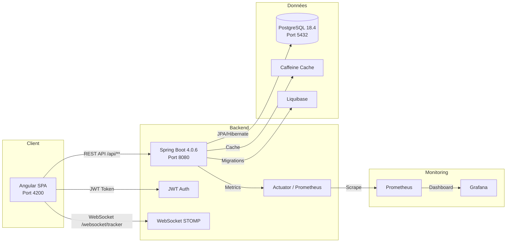
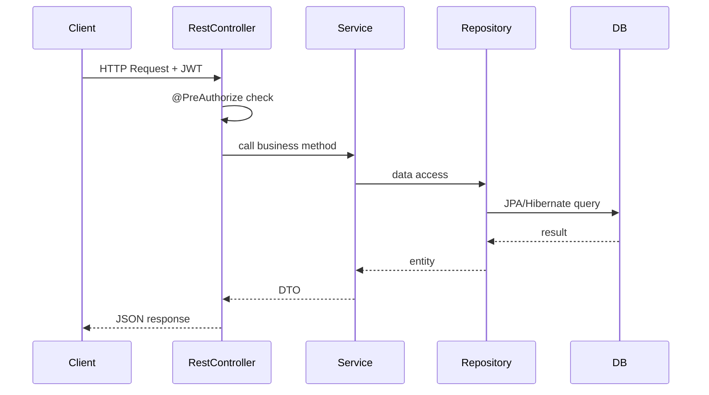
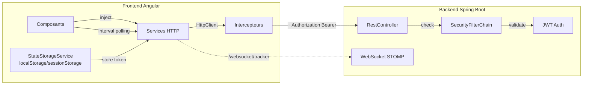

# Architecture

## Vue d'ensemble



## Architecture backend

### Couches

```
src/main/java/com/gestiontaches/
├── config/          # Configuration technique (sécurité, cache, DB, CORS, WebSocket)
├── domain/          # Entités JPA (modèle de données pur)
├── repository/      # Spring Data JPA (accès aux données)
├── service/         # Logique métier + DTOs + critères de filtrage
│   ├── dto/         # Data Transfer Objects
│   ├── criteria/    # Critères de recherche dynamique (JHipster filter)
│   └── mapper/      # MapStruct mappers (entity ↔ DTO)
├── web/
│   └── rest/        # Contrôleurs REST (entry points HTTP)
└── security/        # Authentification, autorités, utils
```

### Flux d'une requête



### Pourquoi ces choix ?

- **Spring Boot + JHipster** : génération rapide d'une architecture standardisée (CRUD, sécurité, audit, cache).
- **JPA/Hibernate** : mapping objet-relationnel, lazy loading, cache second niveau.
- **MapStruct** : mapping efficace entity ↔ DTO, évite le boilerplate.
- **Liquibase** : migrations de base de données versionnées et reproductibles.
- **Caffeine + JCache** : cache en mémoire pour les entités fréquemment lues (users, projects, sprints...).
- **Springdoc-openapi** : documentation automatique de l'API REST.

## Architecture frontend

### Structure des dossiers

```
src/main/webapp/app/
├── core/                     # Logique transversale (auth, interceptors, config)
│   ├── auth/                 # JWT storage, account service, route guard
│   ├── config/               # ApplicationConfigService (endpoint prefix)
│   ├── interceptor/          # HTTP interceptors (auth, error handling)
│   └── request/              # Request/response models
├── shared/                   # Composants et utilitaires réutilisables
│   ├── alert/                # Alertes Bootstrap
│   ├── auth/                 # Directive jhiHasAnyAuthority
│   ├── csv/                  # Download CSV service
│   ├── date/                 # Pipes de formatage de dates
│   ├── filter/               # Filtres de recherche
│   ├── jhipster/             # Constantes, headers, problem details
│   ├── language/             # i18n (ngx-translate)
│   ├── pagination/           # Pagination component
│   └── sort/                 # Tri de colonnes
├── entities/                 # Modules métier (générés + custom)
│   ├── project/              # CRUD + détail + settings + chat enfants
│   ├── sprint/               # CRUD + burndown + backlog + timeline
│   ├── epic/                 # CRUD + burndown + roadmap
│   ├── task/                 # CRUD + kanban + comments + attachments
│   ├── comment/              # CRUD comments
│   ├── attachment/           # Upload/download
│   ├── task-history/         # Historique des tâches
│   ├── chat/                 # Chat temps réel (REST + polling)
│   ├── notification/         # Liste notifications
│   ├── admin/                # Admin : users, authorities, metrics, notifications
│   └── user/                 # Profil utilisateur
├── layouts/                  # Structure de page
│   ├── main/                 # Layout principal
│   ├── navbar/               # Barre de navigation
│   ├── sidebar/              # Barre latérale
│   ├── footer/               # Pied de page
│   ├── error/                # Pages d'erreur (404, 500)
│   ├── search/               # Recherche globale
│   └── profiles/             # Gestion des profils
├── home/                     # Page d'accueil + dashboard
│   └── dashboard/            # Dashboard développeur (KPI, timeline, charts)
├── login/                    # Page de connexion
├── account/                  # Paramètres compte, mot de passe, reset
├── my-tasks/                 # Vue "Mes tâches"
├── notifications/            # Liste notifications
└── config/                   # Configuration Angular (dayjs, i18n, icons)
```

### Stack frontend confirmée

| Bibliothèque | Usage |
|--------------|-------|
| Angular 21 | Framework SPA standalone |
| RxJS 7 | Programmation réactive |
| ngx-translate | Internationalisation |
| Bootstrap 5 + FontAwesome | UI |
| dayjs | Manipulation de dates |
| ngx-infinite-scroll | Scroll infini (chat) |
| @stomp/stompjs + sockjs-client | WebSocket client (disponible, voir chat-temps-reel.md) |
| Cypress | Tests E2E |
| Vitest | Tests unitaires |

### Build intégré

Le build frontend est intégré au build Maven via le plugin `frontend-maven-plugin` :

1. `npm run webapp:prod` → build Angular en mode production
2. Les assets sont copiés dans `target/classes/static/`
3. Le JAR final contient le frontend intégré

En développement, Angular tourne sur le port 4200 et le backend sur 8080, avec un proxy configuré (`proxy.config.mjs`).

## Communication backend ↔ frontend


