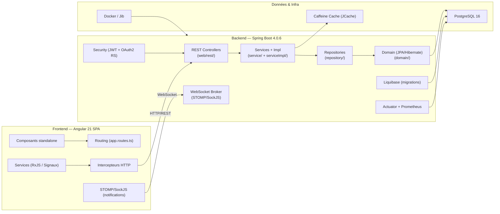

# Architecture globale

## Vue d'ensemble

L'application suit l'architecture standard JHipster : une SPA Angular mono-page communiquant avec une API REST Spring Boot, elle-même persistante en base PostgreSQL.

## Couches backend

### `web.rest` — Controllers REST

- Responsables de l'exposition des endpoints API.
- Chaque entité métier principale a son controller : `ProjectResource`, `TaskResource`, `SprintResource`, `EpicResource`, `CommentResource`, `AttachmentResource`, `NotificationResource`, `ChatResource`, etc.
- Les controllers utilisent des DTOs (MapStruct) pour Project, Sprint, Epic et Task.
- La sécurité est appliquée via `@PreAuthorize` directement sur les méthodes des controllers.
- Endpoints publics notables : `/api/authenticate` (login), `/api/register`, `/api/activate`, `/api/account/reset-password/*`.

### `service` / `serviceImpl` — Logique métier

- Interfaces dans `service/`, implémentations dans `serviceImpl/`.
- Responsables de la logique métier, des validations et des transactions.
- Services concernés : `ProjectService`, `TaskService`, `SprintService`, `EpicService`, `CommentService`, `AttachmentService`, `NotificationService`, `ChatService`, `UserService`, `ProjectPermissionService`, etc.
- `ProjectPermissionService` gère les droits d'accès par projet.

### `repository` — Accès aux données

- Interfaces Spring Data JPA pour chaque entité : `ProjectRepository`, `TaskRepository`, `SprintRepository`, `EpicRepository`, `CommentRepository`, `AttachmentRepository`, `NotificationRepository`, `ChatMessageRepository`, `ConversationRepository`, `ConversationMemberRepository`, `UserPresenceRepository`, `UserRepository`, `AuthorityRepository`, etc.
- Certaines entités disposent de requêtes personnalisées via `@Query` ou méthodes dérivées.
- Les repositories bénéficient du cache Hibernate de second niveau (Caffeine/JCache).

### `domain` — Entités JPA

- Toutes les entités métier avec annotations JPA (`@Entity`, `@Table`, relations `@ManyToOne`, `@OneToMany`, `@ManyToMany`).
- Les enums sont stockés en base comme chaînes de caractères (`@Enumerated(EnumType.STRING)`).
- Le cache Hibernate est activé sur la plupart des entités (`@Cache(usage = CacheConcurrencyStrategy.READ_WRITE)`).

### `config` — Configuration Spring

- `SecurityConfiguration` : chaîne de filtres de sécurité, CORS, session stateless
- `SecurityJwtConfiguration` : encodeur/décodeur JWT Nimbus (HS512)
- `WebsocketConfiguration` : broker STOMP, endpoint SockJS, authentification JWT sur le handshake WebSocket
- `CacheConfiguration` : configuration Caffeine/JCache, caches Hibernate
- `WebConfigurer` : CORS filter, static resources, H2 console (dev)
- `LiquibaseConfiguration` : configuration des migrations
- `AsyncConfiguration` : tâches asynchrones
- `JacksonConfiguration` / `JacksonHibernateConfiguration` : sérialisation JSON

## Couches frontend

### Architecture standalone (Angular 21)

L'application utilise exclusivement des composants **standalone**. Il n'y a pas de `AppModule`. Le bootstrap se fait via :

- `src/main/webapp/main.ts` : point d'entrée
- `src/main/webapp/app/app.config.ts` : configuration de l'application (`provideRouter`, `provideHttpClient`, `provideZonelessChangeDetection`, etc.)
- `src/main/webapp/app/app.routes.ts` : routes racines avec lazy loading

### Organisation des modules fonctionnels

| Dossier | Rôle |
|---------|------|
| `core/` | Services transverses (auth, interceptors, config) |
| `entities/` | Toutes les entités métier (CRUD + composants métier) |
| `home/` | Tableaux de bord (manager/admin/développeur) |
| `my-tasks/` | Vue "Mes Tâches" |
| `notifications/` | Liste et détail des notifications |
| `account/` | Gestion de compte (profil, mot de passe, inscription) |
| `login/` | Écran de connexion |
| `admin/` | Fonctionnalités d'administration |
| `layouts/` | Structure de page (navbar, sidebar, footer, erreurs) |
| `shared/` | Composants et utilitaires partagés |

### Gestion d'état

- **Pas de NGRX/store**. L'état est géré par :
  - Les **signaux Angular** (ex: `signal(0)` pour les compteurs)
  - Les **services RxJS** (`Observable`, `Subject`) pour les flux de données HTTP
  - L'`EventManager` JHipster pour les événements inter-composants légers

### Build et packaging

- **Backend** : Maven avec `frontend-maven-plugin` qui installe Node/npm et build le frontend en prod.
- **Frontend** : builder personnalisé `@angular-builders/custom-esbuild:application` (esbuild, pas webpack).
- **Docker** : plugin Jib Maven construit l'image `gestiontaches:latest` basée sur `eclipse-temurin:25-jre-noble`.
- **Tests unitaires frontend** : Vitest
- **Tests e2e** : Cypress

## Choix architecturaux

| Choix | Justification |
|-------|--------------|
| JHipster générique | scaffolding rapide, conventions établies, sécurité intégrée |
| DTO + MapStruct sur 4 entités | Séparation claire entre API et domaine, contrôle des champs exposés |
| Composants standalone Angular 21 | Architecture moderne, arbre de composants optimisé, zoneless change detection |
| Pas de store global | Simplicité : l'état reste local aux composants/services pour ce périmètre |
| WebSocket STOMP limité aux notifications | Besoin métier couvert : notifications push ; le chat utilise du polling REST |
| Cache Caffeine + JCache | Performance : cache de second niveau Hibernate + cache applicatif |
| Liquibase | Migrations SQL versionnées, rollback, reproductibilité entre environnements |
