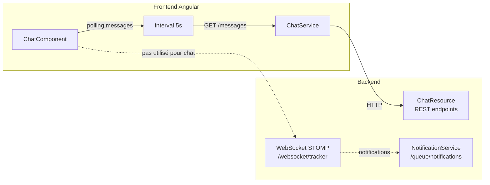

# Chat temps réel

## Architecture confirmée

Le chat du projet utilise **deux mécanismes complémentaires** :

1. **WebSocket STOMP** : configuré et disponible, utilisé pour les **notifications** push (`/queue/notifications`), pas pour le chat lui-même.
2. **Polling REST** : mécanisme **actif et documenté** côté frontend pour le chat (messages).



## Configuration WebSocket

### Backend

Fichier : `src/main/java/com/gestiontaches/config/WebsocketConfiguration.java`

```java
@Configuration
@EnableWebSocketMessageBroker
public class WebsocketConfiguration implements WebSocketMessageBrokerConfigurer {
    @Override
    public void configureMessageBroker(MessageBrokerRegistry config) {
        config.enableSimpleBroker("/queue", "/topic");
        config.setApplicationDestinationPrefixes("/app");
    }

    @Override
    public void registerStompEndpoints(StompEndpointRegistry registry) {
        registry.addEndpoint("/websocket/tracker").setAllowedOriginPatterns("*").withSockJS();
    }
}
```

| Paramètre | Valeur |
|-----------|--------|
| Endpoint STOMP | `/websocket/tracker` |
| Fallback | SockJS |
| Broker | `/queue`, `/topic` |
| Préfixe application | `/app` |
| Origines autorisées | `*` (toutes) |

### Authentification WebSocket

Lors de la connexion STOMP `CONNECT`, un intercepeteur extrait le JWT du header `Authorization` :

```java
List<String> authorization = accessor.getNativeHeader("Authorization");
String bearerToken = authorization.get(0);
String jwtToken = bearerToken.substring(7);
Jwt jwt = jwtDecoder.decode(jwtToken);
Authentication authentication = jwtAuthenticationConverter.convert(jwt);
accessor.setUser(authentication);
```

### Frontend

Les dépendances WebSocket sont présentes dans `package.json` :

```json
"@stomp/stompjs": "^7.3.0",
"sockjs-client": "^1.6.1"
```

Cependant, dans le composant `ChatComponent` (`chat.ts`), **aucune connexion STOMP n'est utilisée**. Le chat utilise exclusivement du polling REST.

## Mécanisme de polling REST (actif)

### Polling des messages

```typescript
// chat.ts
const MESSAGE_POLL_INTERVAL = 5000; // 5 secondes

ngOnInit(): void {
  interval(MESSAGE_POLL_INTERVAL)
    .pipe(takeUntilDestroyed(this.destroyRef))
    .subscribe(() => this.refreshConversations());
}
```

`refreshConversations()` recharge la liste des conversations et les derniers messages de la conversation sélectionnée.

## Canaux de chat

### GENERAL

- Canal partagé avec tous les membres du projet.
- Créé automatiquement au premier accès.
- Retourné en premier dans la liste des conversations.

### DIRECT

- Conversation privée entre exactement deux membres.
- Créée via `POST /api/projects/{projectId}/chat/conversations/direct/{userId}`.
- Si une conversation DIRECT existe déjà entre les deux utilisateurs, elle est retournée (pas de duplication).

## Endpoints REST chat

Tous les endpoints sont sous `/api/projects/{projectId}/chat` et nécessitent `isAuthenticated()`.

| Endpoint | Méthode | Description |
|----------|---------|-------------|
| `/conversations` | GET | Liste des conversations de l'utilisateur |
| `/conversations/direct/{userId}` | POST | Créer/ouvrir une conversation DIRECT |
| `/conversations/{conversationId}/messages` | GET | Messages d'une conversation (pagination `beforeId`/`limit`) |
| `/conversations/{conversationId}/messages` | POST | Envoyer un message |
| `/messages/{messageId}` | PATCH | Éditer un message |
| `/messages/{messageId}` | DELETE | Supprimer un message (soft delete) |
| `/conversations/{conversationId}/read` | POST | Marquer conversation comme lue |
| `/members` | GET | Membres du projet (avec rôle) |
| `/search` | GET | Rechercher des messages (`q`, `limit`) |

## Threads

Un message peut répondre à un autre via `parentMessageId` :

```json
{
  "id": 3,
  "content": "Réponse au message",
  "parentMessageId": 1,
  ...
}
```

**Statut** : architecture uniquement, pas encore connecté à l'UI.

## Événements SSE pour le chat

Bien que le chat utilise du polling REST, des événements SSE existent pour d'autres entités :

- `GET /api/events/stream` — Événements de changement d'entité (project, sprint, epic) via `EntityEventSseService`.

Ces événements ne concernent pas directement le chat, mais pourraient être utilisés pour rafraîchir les listes de conversations sans polling.

## Récapitulatif

| Fonctionnalité | Mécanisme | Fichier backend | Fichier frontend |
|----------------|-----------|-----------------|------------------|
| Envoyer/recevoir messages | **Polling REST** (5s) | `ChatResource.java` | `chat.ts`, `chat.service.ts` |
| Notifications | **STOMP** `/queue/notifications` | `NotificationService.java` | `notification.interceptor.ts` |
| WebSocket config | STOMP + SockJS | `WebsocketConfiguration.java` | `@stomp/stompjs` (disponible) |
| Threads | Stockés en DB, pas d'UI | `ChatMessage.java` | `chat.model.ts` (champ présent) |
