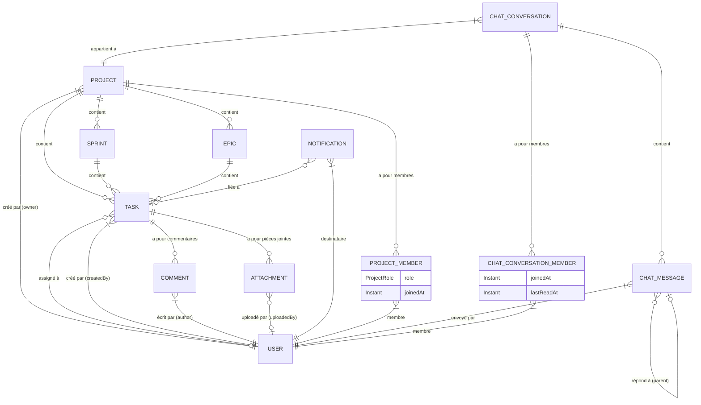

# Modèle de données

## Diagramme ER (Mermaid)



> **Note** : le diagramme ci-dessus fusionne le modèle JDL (`project-management.jdl`) avec les entités chat ajoutées manuellement (`Conversation`, `ConversationMember`, `ChatMessage`).

## Entités principales

### Project

| Attribut | Type | Contraintes | Description |
|----------|------|-------------|-------------|
| `id` | `Long` | PK, auto-généré | Identifiant |
| `name` | `String` | `@NotNull @Size(min=1, max=100)` | Nom du projet |
| `description` | `String` | `@Size(max=500)` | Description libre |
| `key` | `String` | `@NotNull @Size(min=2, max=10)`, unique | Clé courte du projet (ex: `MPROJ`) |
| `createdAt` | `Instant` | `@NotNull` | Date de création |
| `owner` | `User` | ManyToOne (LAZY) | Propriétaire du projet |

**Relations** :
- `1 ── * ProjectMember` (cascade all, orphanRemoval)
- `1 ── * Sprint`
- `1 ── * Epic`
- `1 ── * Task`

### Sprint

| Attribut | Type | Contraintes | Description |
|----------|------|-------------|-------------|
| `id` | `Long` | PK, auto-généré | Identifiant |
| `name` | `String` | `@NotNull @Size(min=1, max=100)` | Nom du sprint |
| `goal` | `String` | `@Size(max=500)` | Objectif |
| `startDate` | `LocalDate` | — | Date de début |
| `endDate` | `LocalDate` | — | Date de fin |
| `status` | `SprintStatus` | `@NotNull` | Statut |
| `project` | `Project` | ManyToOne (required) | Projet parent |

**Relations** :
- `* ── 1 Project`
- `1 ── * Task`

### Epic

| Attribut | Type | Contraintes | Description |
|----------|------|-------------|-------------|
| `id` | `Long` | PK, auto-généré | Identifiant |
| `title` | `String` | `@NotNull @Size(min=1, max=200)` | Titre |
| `description` | `String` | `@Size(max=1000)` | Description |
| `status` | `EpicStatus` | `@NotNull` | Statut |
| `priority` | `Priority` | `@NotNull` | Priorité |
| `createdAt` | `Instant` | `@NotNull` | Date de création |
| `updatedAt` | `Instant` | — | Date de mise à jour |
| `startDate` | `LocalDate` | — | Date de début |
| `endDate` | `LocalDate` | — | Date de fin |
| `project` | `Project` | ManyToOne (required) | Projet parent |

**Relations** :
- `* ── 1 Project`
- `1 ── * Task`

### Task

| Attribut | Type | Contraintes | Description |
|----------|------|-------------|-------------|
| `id` | `Long` | PK, auto-généré | Identifiant |
| `title` | `String` | `@NotNull @Size(min=1, max=200)` | Titre |
| `description` | `String` | `@Size(max=5000)` | Description détaillée |
| `status` | `TaskStatus` | `@NotNull` | Statut |
| `priority` | `Priority` | `@NotNull` | Priorité |
| `createdAt` | `Instant` | `@NotNull` | Date de création |
| `updatedAt` | `Instant` | — | Date de mise à jour |
| `storyPoints` | `Integer` | — | Points d'effort |
| `sprint` | `Sprint` | ManyToOne (LAZY) | Sprint associé |
| `epic` | `Epic` | ManyToOne (LAZY) | Epic associé |
| `project` | `Project` | ManyToOne (required) | Projet parent |
| `assignee` | `User` | ManyToOne (LAZY) | Utilisateur assigné |
| `createdBy` | `User` | ManyToOne (LAZY) | Créateur |

**Relations** :
- `* ── 1 Project`
- `* ── 0..1 Sprint`
- `* ── 0..1 Epic`
- `1 ── * Comment`
- `1 ── * Attachment`

### Comment

| Attribut | Type | Contraintes | Description |
|----------|------|-------------|-------------|
| `id` | `Long` | PK, auto-généré | Identifiant |
| `content` | `String` | `@NotNull @Size(min=1, max=2000)` | Contenu |
| `createdAt` | `Instant` | `@NotNull` | Date de création |
| `task` | `Task` | ManyToOne (required) | Tâche concernée |
| `author` | `User` | ManyToOne (LAZY) | Auteur |

### Attachment

| Attribut | Type | Contraintes | Description |
|----------|------|-------------|-------------|
| `id` | `Long` | PK, auto-généré | Identifiant |
| `fileName` | `String` | `@NotNull @Size(min=1, max=255)` | Nom original |
| `filePath` | `String` | `@NotNull @Size(max=1000)` | Chemin de stockage |
| `uploadedAt` | `Instant` | `@NotNull` | Date d'upload |
| `task` | `Task` | ManyToOne (required) | Tâche associée |
| `uploadedBy` | `User` | ManyToOne (LAZY) | Uploadé par |

### Notification

| Attribut | Type | Contraintes | Description |
|----------|------|-------------|-------------|
| `id` | `Long` | PK, auto-généré | Identifiant |
| `message` | `String` | `@NotNull` | Message |
| `task` | `Task` | ManyToOne (LAZY) | Tâche associée |
| `taskTitle` | `String` | — | Titre de la tâche (dénormalisé) |
| `user` | `User` | ManyToOne (LAZY) | Destinataire |
| `relatedUserId` | `Long` | — | ID utilisateur lié |
| `relatedUserLogin` | `String` | — | Login utilisateur lié |
| `isRead` | `Boolean` | `@NotNull` | Lu / non lu |
| `createdAt` | `Instant` | `@NotNull` | Date de création |

### ProjectMember

| Attribut | Type | Contraintes | Description |
|----------|------|-------------|-------------|
| `id` | `Long` | PK, auto-généré | Identifiant |
| `project` | `Project` | ManyToOne (LAZY) | Projet |
| `user` | `User` | ManyToOne (LAZY) | Utilisateur |
| `role` | `ProjectRole` | `@NotNull` | Rôle dans le projet |
| `joinedAt` | `Instant` | `@NotNull` | Date d'adhésion |

**Contrainte d'unicité** : `(project_id, user_id)` — un utilisateur ne peut être membre qu'une fois par projet.

### Entités chat

#### Conversation

| Attribut | Type | Contraintes | Description |
|----------|------|-------------|-------------|
| `id` | `Long` | PK, auto-généré | Identifiant |
| `type` | `ConversationType` | `@NotNull` | `GENERAL` ou `DIRECT` |
| `name` | `String` | `@Size(max=100)` | Nom optionnel |
| `project` | `Project` | ManyToOne (required) | Projet |
| `createdBy` | `User` | ManyToOne (LAZY) | Créateur |
| `createdAt` | `Instant` | `@NotNull` | Date de création |

**Relations** :
- `1 ── * ConversationMember` (cascade all, orphanRemoval)
- `1 ── * ChatMessage`

#### ConversationMember

| Attribut | Type | Contraintes | Description |
|----------|------|-------------|-------------|
| `id` | `Long` | PK, auto-généré | Identifiant |
| `conversation` | `Conversation` | ManyToOne (required) | Conversation |
| `user` | `User` | ManyToOne (required) | Utilisateur |
| `joinedAt` | `Instant` | `@NotNull` | Date d'adhésion |
| `lastReadAt` | `Instant` | — | Dernière lecture |

**Contrainte d'unicité** : `(conversation_id, user_id)`.

#### ChatMessage

| Attribut | Type | Contraintes | Description |
|----------|------|-------------|-------------|
| `id` | `Long` | PK, auto-généré | Identifiant |
| `content` | `String` | `@NotNull @Size(min=1, max=5000)` | Contenu |
| `conversation` | `Conversation` | ManyToOne (required) | Conversation |
| `sender` | `User` | ManyToOne (required) | Expéditeur |
| `parentMessage` | `ChatMessage` | ManyToOne (LAZY) | Message parent (thread) |
| `createdAt` | `Instant` | `@NotNull` | Date d'envoi |
| `editedAt` | `Instant` | — | Date de modification |
| `deleted` | `Boolean` | `@NotNull`, défaut `false` | Suppression douce |

**Relations** :
- `* ── 1 Conversation`
- `* ── 1 User (sender)`
- `* ── 0..1 ChatMessage (parent)`

## Enums

### TaskStatus

| Valeur | Description |
|--------|-------------|
| `NEW` | Nouveau |
| `IN_PROGRESS` | En cours |
| `READY_FOR_TEST` | Prêt pour test |
| `DONE` | Terminé |
| `NEEDS_INFO` | Besoin d'informations |

### Priority

| Valeur | Description |
|--------|-------------|
| `LOWEST` | Très basse |
| `LOW` | Basse |
| `MEDIUM` | Moyenne |
| `HIGH` | Haute |
| `HIGHEST` | Très haute |

### SprintStatus

| Valeur | Description |
|--------|-------------|
| `PLANNED` | Planifié |
| `ACTIVE` | En cours |
| `COMPLETED` | Terminé |
| `CANCELLED` | Annulé |

### EpicStatus

| Valeur | Description |
|--------|-------------|
| `TODO` | À faire |
| `IN_PROGRESS` | En cours |
| `DONE` | Terminé |
| `CANCELLED` | Annulé |

### ProjectRole

| Valeur | Description |
|--------|-------------|
| `OWNER` | Propriétaire |
| `MANAGER` | Gestionnaire |
| `MEMBER` | Membre |

### ConversationType

| Valeur | Description |
|--------|-------------|
| `GENERAL` | Canal général partagé |
| `DIRECT` | Conversation privée entre deux membres |

## Workflows de statuts

### Sprint

```
PLANNED → ACTIVE
ACTIVE → COMPLETED
ACTIVE → CANCELLED
```

- Un sprint `COMPLETED` ou `CANCELLED` est verrouillé (ne peut plus changer).
- Un projet ne peut avoir qu'un seul sprint `ACTIVE` à la fois.
- Le statut est aussi recalculé automatiquement selon les tâches :
  - Au moins une tâche `IN_PROGRESS` ou `READY_FOR_TEST` → `ACTIVE`
  - Toutes les tâches `DONE` → `COMPLETED`
  - Sinon → `PLANNED` (par défaut)

### Epic

```
TODO → IN_PROGRESS
IN_PROGRESS → DONE
IN_PROGRESS → CANCELLED
```

- Un epic `DONE` ou `CANCELLED` est verrouillé.
- Recalcul automatique :
  - Au moins une tâche `IN_PROGRESS` ou `READY_FOR_TEST` → `IN_PROGRESS`
  - Toutes les tâches `DONE` → `DONE`
  - Sinon → `TODO`

### Task

**Aucune transition de statut n'est validée côté service** — le statut peut être changé librement via PUT/PATCH.

Les seules règles indirectes :
- À la création, le statut est forcé à `NEW` si non fourni.
- Le changement de statut déclenche des notifications (assigné, créateur).
- Le passage à `DONE` peut déclencher une notification au créateur/assigné si l'un des deux est `ROLE_ADMIN`.

## Règles métier intégrées au modèle

- **Projet** : clé unique (`key`), nom unique non garanti par la DB mais géré en métier.
- **ProjectMember** : unicité `(project_id, user_id)`.
- **ConversationMember** : unicité `(conversation_id, user_id)`.
- **Attachment** : le nom de fichier stocké est préfixé par un UUID (`UUID.randomUUID() + "_" + originalName`).
- **ChatMessage** : suppression douce (`deleted = true`), les messages ne sont jamais physiquement supprimés.
- **Notification** : purge automatique quotidienne à 3h des notifications de plus de 15 jours (`@Scheduled`).
